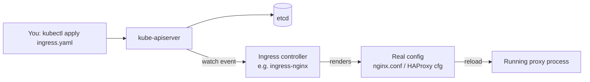
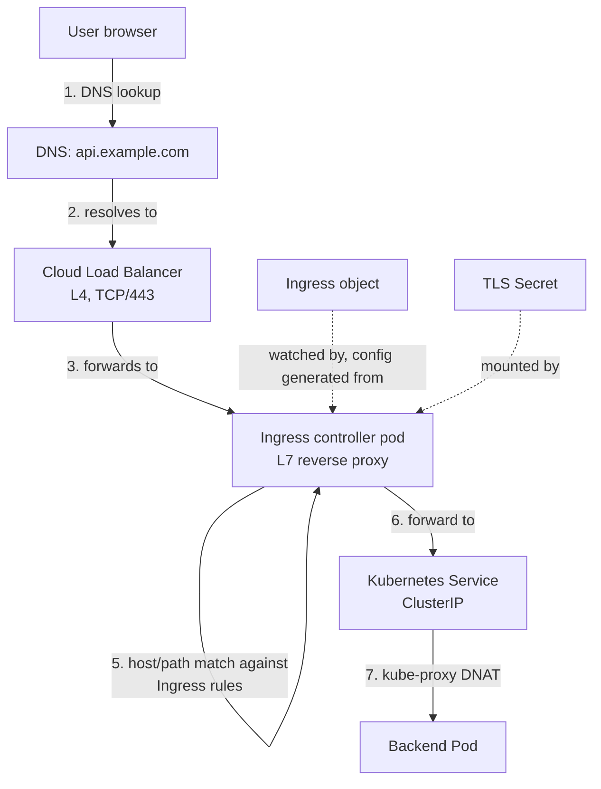
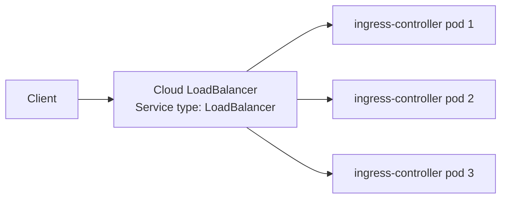
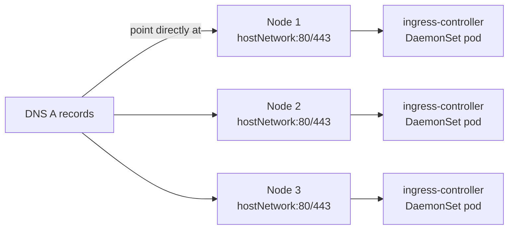
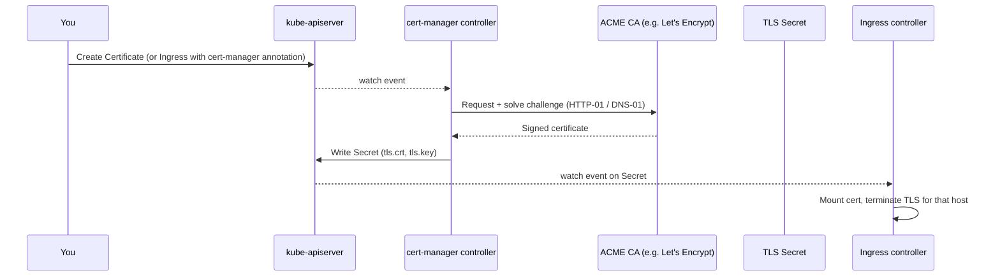
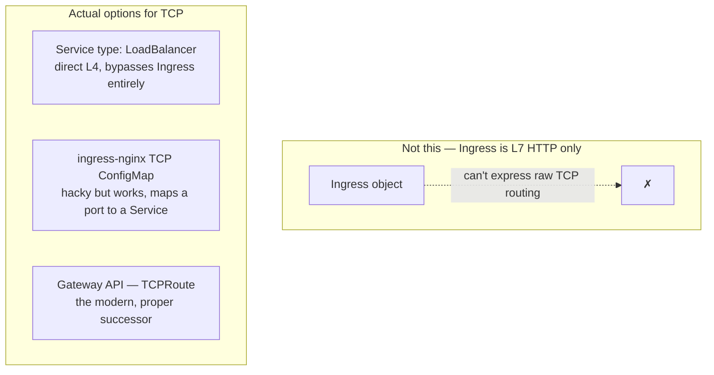

# Ingress & Ingress Controllers — Architecture Notes

> Companion to `kubernetes-internals-notes.md`. Focus: Ingress as an API object vs Ingress Controller as the thing that actually does work, the two ways it gets deployed in front of real traffic, and where TLS and non-HTTP traffic fit in.

---

## 1. The one distinction that unlocks everything

**`Ingress` is just a Kubernetes object** — a piece of desired state sitting in etcd, no different in kind from a Pod or a ConfigMap. It has **no effect on traffic by itself.**

**Ingress Controller is a workload you deploy** (nginx, Traefik, HAProxy, cloud ALB controller, etc.) that watches `Ingress` objects through the API server and translates them into real proxy configuration.

If you create an `Ingress` with zero controllers running in the cluster, nothing happens — no error, no traffic, just an inert object. This is the #1 thing interviewers check you actually understand.



---

## 2. Full request-path architecture



Two planes worth separating explicitly:

- **Control plane**: Ingress object → watched by the ingress controller → rendered into config. This is a normal Kubernetes reconcile loop, same pattern as everything else.
- **Data plane**: the actual TCP/TLS connections flowing user → cloud LB → ingress controller pod → Service → backend pod. None of these hops talk to the API server at request time — they're just moving bytes as fast as possible.

**Interview framing**: *"The ingress controller sits **above** the load balancer in the control-plane sense — it's the brain deciding routing config — but the controller's own pods sit **in the data path**, below the cloud LB, actually terminating and proxying every request."* This directly answers the "above/below the LB" question from your notes.

---

## 3. Two deployment topologies

### A. Cloud LB in front (most common on GKE/EKS/AKS)



- The ingress controller Deployment is exposed via a `Service` of `type: LoadBalancer`.
- The cloud provider's `cloud-controller-manager` watches that Service and provisions a real cloud load balancer, which health-checks and spreads traffic across controller pods.
- Simple, standard, what you get by default when you `helm install ingress-nginx`.
- Downside: an extra network hop and an extra L4 LB to pay for/manage; source IP preservation needs `externalTrafficPolicy: Local` or proxy protocol.

### B. No cloud LB — controller on the host network



- Ingress controller runs as a `DaemonSet` with `hostNetwork: true`, binding directly to node ports 80/443.
- DNS (or an external/on-prem LB you manage yourself) points straight at node IPs.
- Common in bare-metal/on-prem clusters where there's no cloud provider to hand you a managed LB, or where you're deliberately avoiding the extra hop's cost/latency.
- You lose the cloud LB's built-in health checking across nodes — you own that (e.g. via keepalived/VRRP, or an external LB like the HAProxy you're already running).

**This second pattern is exactly the shape of your HAProxy + Jetty 12 PoC** — HAProxy in that role is functioning as your own hand-rolled L4/L7 front door instead of a cloud LB or in-cluster controller.

---

## 4. TLS: where cert-manager plugs in



- `Ingress.spec.tls` references a **Secret name** — cert-manager's job is purely to keep that Secret populated and rotated with a valid cert; it has no runtime relationship to the ingress controller beyond that.
- **HTTP-01 challenge** (common default): cert-manager temporarily creates its own tiny Ingress rule to answer the ACME challenge at `/.well-known/acme-challenge/...` — meaning the ingress controller itself is unknowingly part of completing the cert issuance for HTTP-01. Worth knowing cold since it trips people up in production ("why is there a random extra Ingress object").
- **DNS-01 challenge**: no dependency on the ingress controller at all — cert-manager creates a TXT record via a DNS provider API instead. Needed for wildcard certs.
- With Jetty 12 doing its own TLS (as in your PoC), you're bypassing this whole Ingress-Secret-mount pattern — cert-manager would instead just deliver the Secret and *you* wire it into Jetty's keystore directly, since Jetty is terminating TLS itself rather than the ingress controller.

---

## 5. Routing mechanics — how one Ingress becomes many rules

```yaml
apiVersion: networking.k8s.io/v1
kind: Ingress
metadata:
  name: billing-ingress
  annotations:
    cert-manager.io/cluster-issuer: letsencrypt-prod
spec:
  ingressClassName: nginx
  tls:
    - hosts: [api.example.com]
      secretName: api-example-tls
  rules:
    - host: api.example.com
      http:
        paths:
          - path: /billing
            pathType: Prefix
            backend:
              service:
                name: billing-svc
                port: {number: 8080}
          - path: /invoices
            pathType: Prefix
            backend:
              service:
                name: invoices-svc
                port: {number: 8080}
```

- **`ingressClassName`** picks which controller should handle this object — critical once you have more than one controller in a cluster (e.g. an internal-only nginx class and a public ALB class). Before this field existed, it was done via a `kubernetes.io/ingress.class` annotation — still worth knowing if you touch older clusters.
- One `Ingress` object can define many host/path rules, and rules from many `Ingress` objects targeting the same `ingressClassName` all get merged into one controller's config — this is why "who owns this route" audits get messy at scale.
- Annotations are the controller-specific escape hatch for anything the generic Ingress spec can't express (rewrite rules, rate limiting, custom timeouts, the cert-manager issuer above) — this is *the* reason different controllers aren't drop-in interchangeable despite sharing the same `Ingress` API.

---

## 6. Ingress controller comparison (quick recall table)

| Controller | Proxy engine | Notable trait |
|---|---|---|
| ingress-nginx | nginx | Most widely deployed, huge annotation surface |
| Traefik | native Go proxy | Native support for Let's Encrypt without cert-manager, dynamic config without reloads |
| HAProxy Ingress | HAProxy | Strong for high-throughput/long-lived connections — relevant to your TCP work |
| AWS ALB / GCE Ingress | cloud-native LB | No controller pods at all — the cloud LB itself *is* the data plane, config pushed via cloud APIs |
| Kong / Istio Gateway | Kong/Envoy | Adds API-gateway features (auth, transformation) beyond routing |

---

## 7. What Ingress *can't* do — and where your TCP PoC actually lives

Ingress (the API) is **HTTP/HTTPS only** — it understands host headers and URL paths, both L7 HTTP concepts. It cannot route based on raw TCP.

For your billing system's long-lived TCP connections, the options are:



- **Direct `LoadBalancer` Service**: simplest — skip Ingress altogether, let the cloud LB hit your TCP service directly. This is almost certainly the closest match to what your HAProxy-in-front-of-Jetty setup is doing.
- **ingress-nginx TCP/UDP ConfigMap**: a known workaround where you map an external port straight to a Service in a special ConfigMap — works, but it's outside the normal Ingress object model and each controller does it differently (if at all).
- **Gateway API** (`Gateway`, `TCPRoute`, `HTTPRoute`, `GRPCRoute`): the actual designed successor to Ingress, explicitly built to handle L4 (TCP/UDP) and L7 in one consistent API instead of vendor-specific annotations. Worth name-dropping in your session as "where this is all heading" — Ingress is functionally frozen/legacy at this point.

---

## 8. Interview rapid-fire

- **Does creating an Ingress object route any traffic by itself?** No — it's inert without a controller watching it.
- **What decides which controller handles an Ingress?** `spec.ingressClassName`, matched against an `IngressClass` object.
- **Where does TLS termination actually happen?** At the ingress controller pod (or the cloud LB, in ALB/GCE-native mode) — not at the backend pod, unless you deliberately re-encrypt for end-to-end TLS.
- **Why can't Ingress route raw TCP?** It's an L7 HTTP-specific API — no concept of routing below the HTTP host/path layer. Gateway API's `TCPRoute` fills that gap.
- **What's the practical difference between the two deployment topologies (cloud LB vs hostNetwork DaemonSet)?** Cloud LB gives you managed health-checking/failover at the cost of an extra hop and cloud LB billing; hostNetwork DaemonSet removes that hop but makes you own failover across nodes yourself.
- **How does cert-manager complete an HTTP-01 challenge without you doing anything?** It transiently creates its own Ingress rule under `/.well-known/acme-challenge/` that your existing ingress controller picks up automatically, since it's watching all Ingress objects, not just yours.
