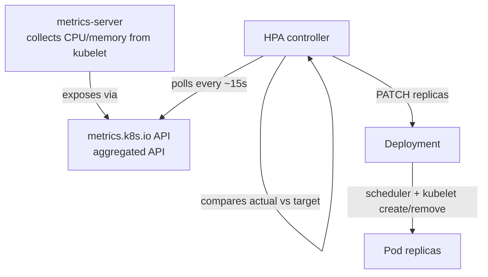
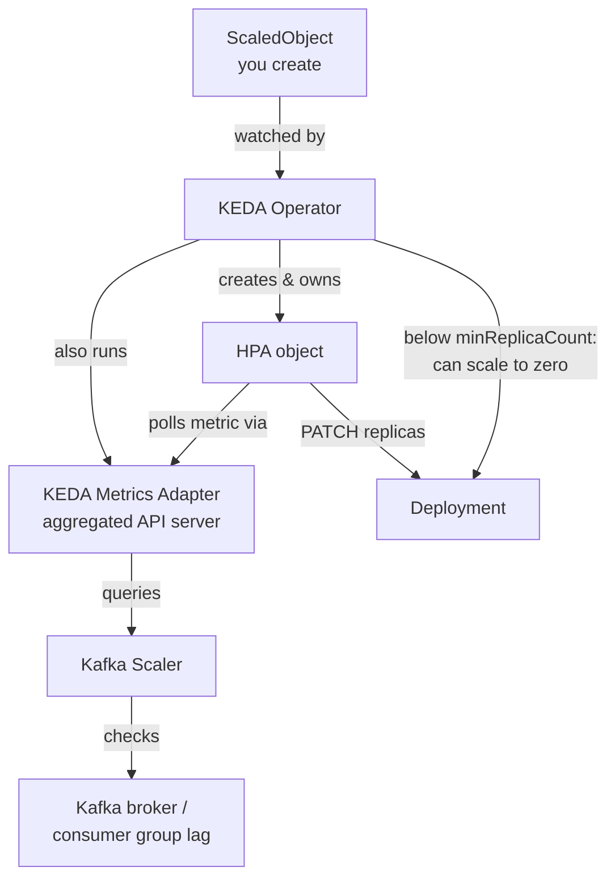
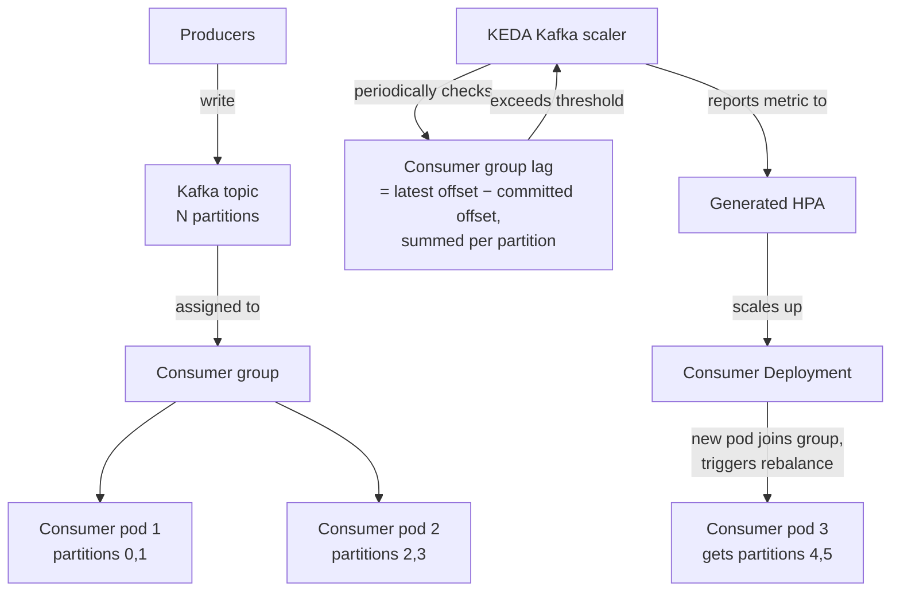

# HPA, KEDA & Kafka Consumer Scaling — Architecture Notes

> Companion to the K8s internals and Ingress notes. Focus: how autoscaling actually decides to add/remove pods, why plain HPA breaks down for Kafka consumers, and how KEDA fixes it.

---

## 1. HPA (Horizontal Pod Autoscaler) — the baseline

### What it is
A controller — same reconcile-loop pattern as everything else in Kubernetes — that watches a metric, compares it to a target, and PATCHes `spec.replicas` on a Deployment/StatefulSet.



### The math it runs
```
desiredReplicas = ceil( currentReplicas × ( currentMetricValue / desiredMetricValue ) )
```
Example: 4 pods running at 80% CPU, target is 50% → `ceil(4 × 80/50) = 7` replicas.

### Key limitation — this is the whole reason KEDA exists
Out of the box, HPA only understands:
1. **Resource metrics** — CPU, memory (via metrics-server).
2. **Custom metrics** — anything exposed via a **custom metrics adapter** registered on the aggregation layer (e.g. Prometheus Adapter translating a PromQL query into a metric HPA can read).
3. **External metrics** — same idea, for metrics that don't belong to any Kubernetes object at all (e.g. queue depth from a cloud provider).

**Every one of these needs you to run and maintain your own metrics adapter.** There's no built-in way to say "scale based on Kafka consumer lag" — you'd have to hand-build a Prometheus exporter + Prometheus Adapter + PromQL query just to get one signal into HPA. This is exactly the gap KEDA fills.

---

## 2. KEDA — Kubernetes Event-Driven Autoscaling

### What it is
KEDA doesn't replace HPA — **it generates and manages an HPA object for you**, and plugs in dozens of pre-built "scalers" (Kafka, RabbitMQ, SQS, Redis, Postgres, Prometheus, cron, etc.) so you never write a custom metrics adapter yourself.



### What KEDA adds on top of HPA
- **Scale-to-zero**: HPA's floor is 1 replica minimum — it has no concept of "zero." KEDA's operator itself watches the event source directly (outside the HPA loop) when replicas are at zero, and scales 0→1 the moment an event appears, then hands control back to the generated HPA for 1→N scaling.
- **Dozens of built-in scalers**: no need to hand-roll a Prometheus Adapter + exporter for common systems — Kafka, RabbitMQ, SQS, Azure Service Bus, Postgres, cron schedules, and more ship out of the box.
- **`ScaledObject`** is the CRD you actually write — it wraps target reference, scaler config, min/max replicas, polling interval, and cooldown period. KEDA's operator reconciles this into a real `HPA` under the hood, following the exact same watch-and-reconcile pattern as every other controller you've now seen three times in these notes.

---

## 3. Kafka consumer scaling — the concrete case

### Why plain CPU-based HPA is the wrong tool here
A Kafka consumer under backlog pressure often shows **normal or even low CPU** — it's I/O-bound, waiting on network/broker, not computing. CPU-based HPA would never scale up while your consumer group falls further behind on lag. **The correct signal is consumer lag, not CPU.**

### End-to-end flow with KEDA's Kafka scaler



### The constraint that makes this different from typical HPA scaling
**You cannot have more active consumers in a group than partitions on the topic** — extra consumer pods beyond the partition count just sit idle. This means:
- `maxReplicaCount` in your `ScaledObject` should realistically be capped at the partition count.
- Partition count becomes a capacity-planning decision made at topic-creation time, not something you can fix later by just adding more pods — worth calling out explicitly if this comes up architecturally, since it's a common mistake (over-provisioning consumer replicas past partition count gets you nothing).
- Scaling *down* isn't instant either — a rebalance happens every time group membership changes, causing a brief pause in consumption while partitions are reassigned. KEDA's `cooldownPeriod` exists specifically to avoid thrashing (rapid scale up/down triggering repeated rebalances).

### Example `ScaledObject` for this scenario
```yaml
apiVersion: keda.sh/v1alpha1
kind: ScaledObject
metadata:
  name: billing-consumer-scaler
spec:
  scaleTargetRef:
    name: billing-consumer-deployment
  minReplicaCount: 1
  maxReplicaCount: 6          # matches topic partition count
  cooldownPeriod: 60
  triggers:
    - type: kafka
      metadata:
        bootstrapServers: kafka-broker:9092
        consumerGroup: billing-consumer-group
        topic: billing-events
        lagThreshold: "50"     # scale up if lag per partition exceeds this
```

---

## 4. Side-by-side: HPA alone vs KEDA

| | Plain HPA | KEDA |
|---|---|---|
| Native metrics | CPU, memory | Same, plus 60+ event source scalers out of the box |
| Custom metrics (e.g. Kafka lag) | You build & run your own metrics adapter | Built-in Kafka scaler, no adapter to maintain |
| Scale to zero | Not supported (min 1) | Supported — operator watches the source directly at zero |
| What you actually write | `HorizontalPodAutoscaler` object | `ScaledObject` — KEDA generates the HPA for you |
| Relationship | Standalone | Sits *on top of* HPA, doesn't replace the mechanism |

**One-line summary for your session**: *KEDA is not a replacement for HPA — it's a metrics-sourcing layer plus a scale-to-zero capability, sitting on top of HPA, so you can trigger scaling on real business signals like Kafka lag instead of just CPU/memory.*

---

## 5. Interview rapid-fire

- **Why doesn't HPA scale Kafka consumers well without KEDA?** CPU/memory don't correlate with backlog for I/O-bound consumers; you'd need a custom metrics adapter (e.g. Prometheus Adapter) to get lag into HPA at all, which KEDA gives you pre-built.
- **Does KEDA replace HPA?** No — it creates and manages an HPA object under the hood; it adds scale-to-zero and pluggable external scalers on top.
- **What happens if you set `maxReplicaCount` above your Kafka topic's partition count?** Extra pods join the consumer group but get zero partitions assigned — pure waste, no throughput gain.
- **What's the risk of scaling too aggressively on a Kafka consumer?** Frequent rebalances — each membership change pauses consumption briefly while partitions are reassigned across the group, so overly twitchy scaling can hurt throughput more than it helps.
- **How does KEDA achieve scale-to-zero when HPA can't go below 1?** The KEDA operator itself polls the event source directly while replicas are at zero (bypassing HPA, which only runs against ≥1 replica), and flips replicas to 1 the moment an event appears — HPA then takes over normal 1→N scaling from there.
