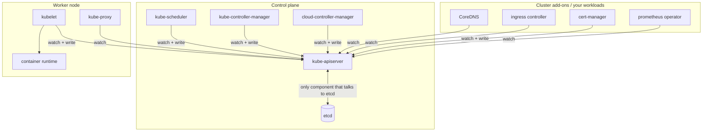
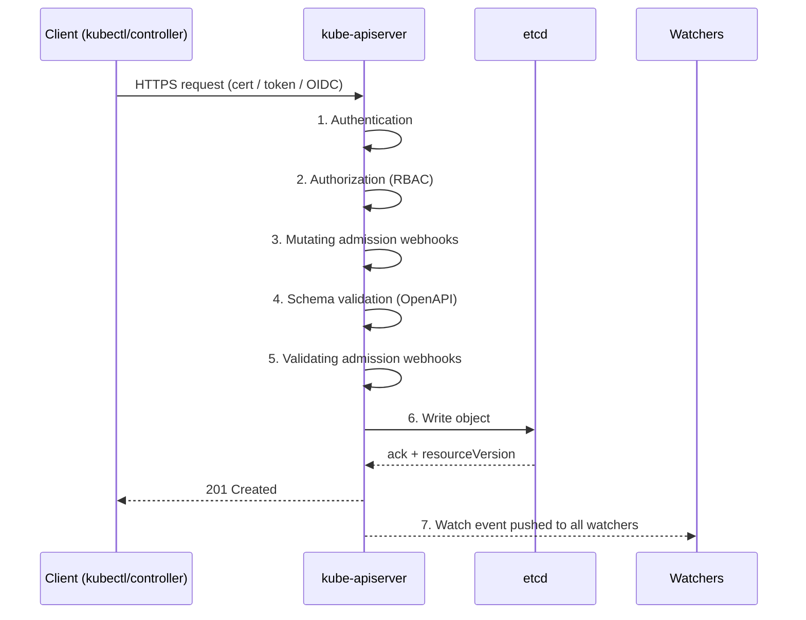
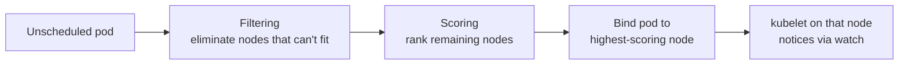
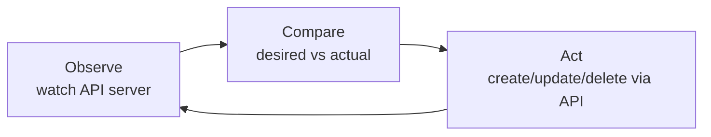
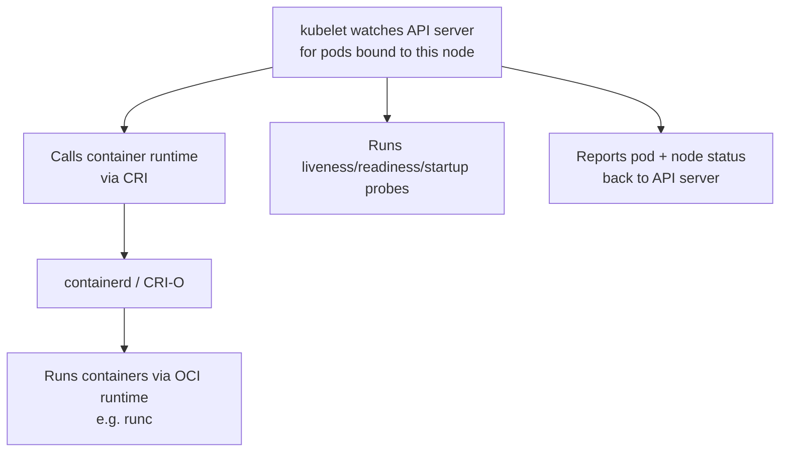
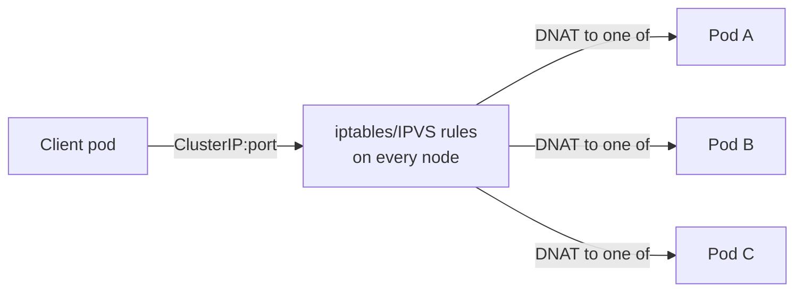
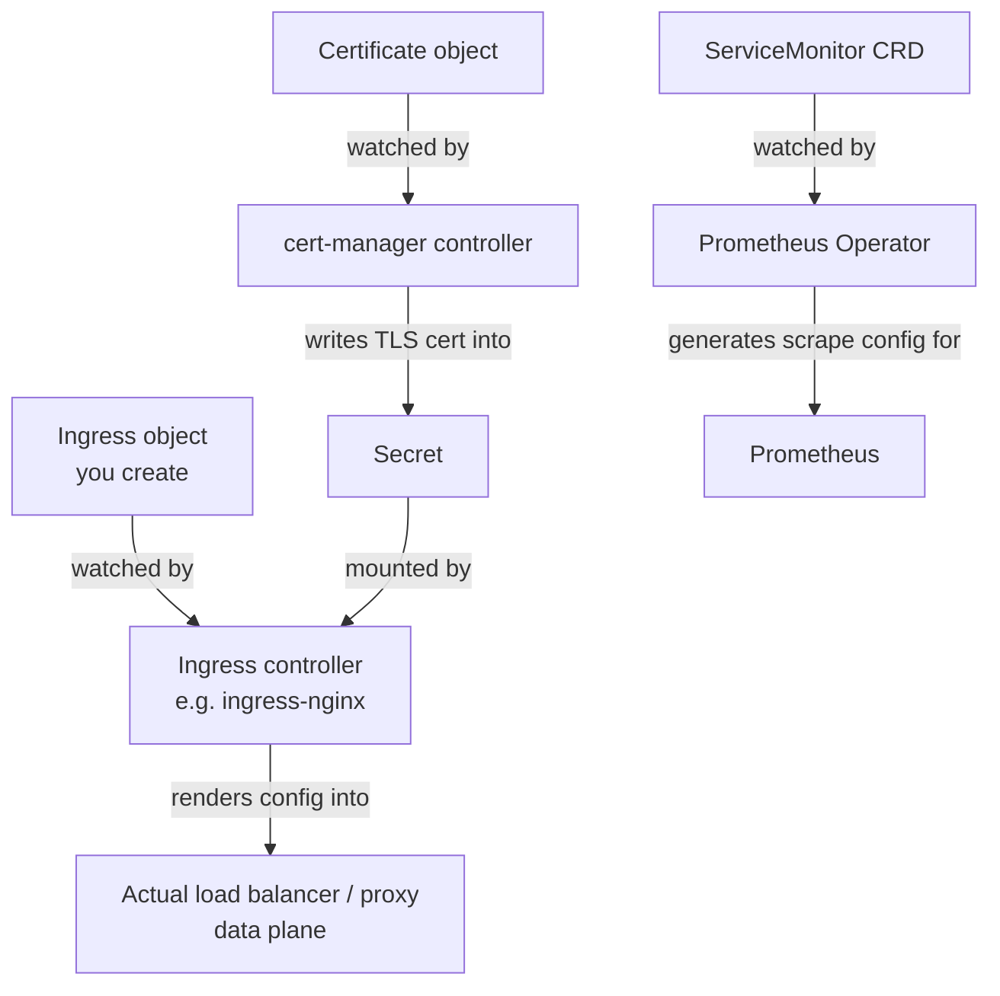

# Kubernetes Internals — Interview Notes

> Focus: what each component does, how it talks to the others, and the questions interviewers actually ask about it.

---

## 1. Big picture — control plane vs data plane

**Rule that explains 80% of Kubernetes**: kube-apiserver is the *only* component allowed to talk to etcd. Every other piece — including things you deploy yourself like ingress-nginx or cert-manager — is just an API client that reads (watches) and writes (via REST calls) through the API server.

**Interview one-liner**: *"Kubernetes is a distributed control system. etcd holds desired state, the API server is the single gateway to it, and every controller runs an independent reconcile loop that watches state and drives reality toward it."*

---

## 2. kube-apiserver

### What it is
A stateless REST server (can run multiple replicas behind a load balancer for HA) that is the front door for every read/write in the cluster. It exposes resources as HTTP endpoints (`/api/v1/pods`, `/apis/apps/v1/deployments`, etc.), validates them, and persists them to etcd.

### Request lifecycle (the part interviewers love asking about)

1. **Authentication** — client cert, bearer/service-account token, or OIDC. Produces an identity (username + groups), nothing more.
2. **Authorization** — RBAC (most common), or ABAC/Webhook authorization. Checks verb + resource + namespace against Role/ClusterRole bindings.
3. **Mutating admission webhooks** — can modify the object. Example: cert-manager's mutating webhook sets defaults on a `Certificate`; Istio's sidecar injector adds a container here.
4. **Schema validation** — object is validated against the OpenAPI schema for that GroupVersionKind.
5. **Validating admission webhooks** — accept/reject only, no modification. cert-manager's validating webhook lives here — rejects malformed `Certificate`/`Issuer` before they hit etcd.
6. **Persist to etcd** — the only write path in the whole cluster.
7. **Watch notification** — every open watch connection on that resource type gets the event immediately (no polling).

### Key concepts
- **API groups/versions**: `core` (`v1`), `apps/v1`, `networking.k8s.io/v1`, etc. Lets the API evolve without breaking clients.
- **Aggregation layer**: lets you register additional API servers (e.g. `metrics.k8s.io` served by metrics-server) that appear as native extensions of the main API.
- **CRDs (Custom Resource Definitions)**: how cert-manager's `Certificate`/`Issuer` and Prometheus Operator's `ServiceMonitor` exist — they extend the API without needing a separate aggregated API server.
- **resourceVersion**: an opaque, monotonically increasing token (backed by etcd's revision) used for optimistic concurrency and to resume watches after a disconnect.

### Interview Q&A
| Q | A |
|---|---|
| Why is the API server stateless? | All state lives in etcd; the API server can be scaled horizontally behind an LB with no session affinity needed. |
| Difference between mutating and validating webhooks? | Mutating can change the object; validating can only accept/reject. Mutating always runs first. |
| What happens if etcd is down? | Reads may be served from apiserver cache in some cases, but all writes fail. Existing pods keep running (kubelet doesn't need the apiserver to keep containers alive), but nothing new can be scheduled/reconciled. |
| How does the apiserver protect against thundering-herd on restart? | Watch caches + `resourceVersion`-based resumption; clients don't need a full LIST unless their watch has expired. |

---

## 3. etcd

### What it is
A distributed, strongly consistent key-value store using the **Raft consensus algorithm**. It's the single source of truth for all cluster state — every Pod, Deployment, Secret, ConfigMap spec and status lives here as a key like `/registry/pods/<namespace>/<name>`.

### Why Raft matters here
- Odd number of nodes (3 or 5) for quorum-based leader election.
- All writes go through the Raft leader; a majority of nodes must acknowledge before a write is committed.
- This is why etcd latency directly affects API server write latency — it's a common production bottleneck at scale.

### Key concepts
- **Watch API**: etcd itself supports watching key prefixes — this is what kube-apiserver builds its own watch feature on top of.
- **Compaction**: etcd keeps history of revisions; old revisions get compacted periodically, which is why long-disconnected watchers sometimes get a "resourceVersion too old" error and must re-LIST.
- **MVCC (multi-version concurrency control)**: every write creates a new revision rather than overwriting — this is what makes watches and historical reads possible.

### Interview Q&A
| Q | A |
|---|---|
| Why not just use a regular SQL database? | Kubernetes needs a native watch/notify primitive with strong consistency and low-latency leader election — etcd's Raft + watch model fits directly; a relational DB would need this built on top. |
| What's the failure mode with even-numbered etcd clusters? | Split votes are more likely (no tie-breaker majority), so odd counts (3, 5) are always recommended. |
| How is etcd backed up? | `etcdctl snapshot save` — this is a common real-world DR question. |

---

## 4. kube-scheduler

### What it does
Watches for Pods with `spec.nodeName` unset, picks the best node, and writes the binding back through the API server (a `Binding` subresource) — the scheduler **never talks to the node directly**.

### Two-phase algorithm

- **Filtering** (formerly "predicates"): resource requests fit, node selectors/affinity match, taints are tolerated, ports don't conflict, volume zone matches, etc.
- **Scoring** (formerly "priorities"): spreads pods across nodes/zones, prefers nodes with more free resources (or less, depending on policy), honors pod (anti-)affinity, image locality, etc.

### Interview Q&A
| Q | A |
|---|---|
| How does the scheduler actually assign a pod to a node? | It doesn't call the node — it PATCHes the Pod's `spec.nodeName` via the API server. kubelet on that node picks it up through its own watch. |
| Difference between node affinity and taints/tolerations? | Affinity is the pod expressing a preference/requirement for node properties; taints/tolerations are the node repelling pods unless they explicitly tolerate it. Opposite directions of the same mechanism. |
| Can you run multiple schedulers? | Yes — `schedulerName` in the pod spec lets you route to a custom scheduler, common for GPU/ML workload schedulers. |

---

## 5. kube-controller-manager

### What it is
A single binary that bundles many independent control loops, each watching one resource type and reconciling it. Running them in one process was a historical/operational simplification, not a logical necessity.

### Notable controllers inside it
| Controller | Watches | Reconciles |
|---|---|---|
| Deployment controller | Deployments | Creates/updates ReplicaSets |
| ReplicaSet controller | ReplicaSets | Creates/deletes Pods to match `replicas` |
| Node controller | Nodes | Marks nodes NotReady, evicts pods after timeout |
| Endpoint(Slice) controller | Services + Pods | Keeps Service → Pod IP mappings current |
| Job controller | Jobs | Tracks pod completions/failures |
| Namespace controller | Namespaces | Garbage-collects resources in deleted namespaces |

### The universal control loop

Every single controller — including cert-manager's, ingress-nginx's, and Prometheus Operator's — follows exactly this loop. This is *the* mental model to lead your session with.

### Interview Q&A
| Q | A |
|---|---|
| Why does a Deployment create a ReplicaSet instead of Pods directly? | Separation of concerns: Deployment manages rollout history/versioning, ReplicaSet just guarantees replica count. Rollbacks work by pointing back at an old ReplicaSet. |
| How does the node controller detect a dead node? | kubelet sends periodic heartbeats (lease objects since 1.14+, lighter than full Node status updates); missing heartbeats past a threshold flips the node to `NotReady`, then pods are evicted after a further grace period. |

---

## 6. kubelet

### What it does
The agent on every node. It watches the API server for Pods assigned to its node (`spec.nodeName == <this node>`) and makes the container runtime match that spec. It also reports node/pod status back.

### Key concepts
- **CRI (Container Runtime Interface)**: gRPC API that decouples kubelet from any specific runtime — this is why Docker was deprecated as a *direct* runtime (dockershim removed), while containerd (which Docker itself uses under the hood) remains fully supported via CRI.
- **PLEG (Pod Lifecycle Event Generator)**: kubelet's internal mechanism to detect container state changes efficiently instead of polling every container constantly.
- **Static pods**: pods defined by a manifest file on the node itself (not via the API server) — this is literally how control plane components (apiserver, etcd, scheduler) are often run on kubeadm clusters, bootstrapping the chicken-and-egg problem.
- **Probes**: liveness (restart if failing), readiness (remove from Service endpoints if failing), startup (delays the other two until slow-starting apps are ready) — directly relevant to your billing/POS long-lived TCP app work.

### Interview Q&A
| Q | A |
|---|---|
| What happens to running pods if kubelet crashes? | Containers keep running (they're managed by the container runtime, not kubelet directly) — but no new pods get scheduled there and status stops updating until kubelet recovers. |
| Difference between liveness and readiness probe failure? | Liveness failure → container is killed and restarted. Readiness failure → pod is pulled out of Service endpoints but left running (useful for temporary overload rather than crash-restart). |
| What's a static pod used for? | Bootstrapping control plane components without needing an API server to already exist. |

---

## 7. kube-proxy and service networking

### What it does
Implements the virtual IP for a `Service` on every node, so any pod can reach `ClusterIP:port` and get load-balanced to a backend pod — without the client knowing which pod it landed on.

### Modes
- **iptables mode** (older default): kube-proxy writes iptables DNAT rules; rule evaluation is roughly O(n) with number of services — becomes a bottleneck at very large scale.
- **IPVS mode**: uses the kernel's IP Virtual Server, O(1) lookup via hash tables, supports more load-balancing algorithms (round robin, least connection). Preferred for large clusters.
- **eBPF-based** (Cilium, etc.): replaces kube-proxy entirely for even lower overhead — worth mentioning if asked about the future direction.

### How Services get their backend list
The **EndpointSlice controller** (in kube-controller-manager) watches Pods matching a Service's selector and maintains the list of ready pod IPs; kube-proxy watches those EndpointSlices and programs the actual rules.

### Interview Q&A
| Q | A |
|---|---|
| ClusterIP vs NodePort vs LoadBalancer vs Ingress? | ClusterIP = internal only. NodePort = exposes a port on every node's IP. LoadBalancer = provisions a cloud LB pointing at NodePorts. Ingress = L7 HTTP(S) routing layered on top of Services, usually via a single LoadBalancer for many hostnames/paths — much cheaper than one LB per service. |
| Why does a Service work even if pods are on a different node? | kube-proxy rules exist on every node, and the cluster's CNI network makes every pod IP routable from every node, so DNAT can hand off to any pod regardless of location. |

---

## 8. CNI (networking plugin)

Not a single process — a spec. On pod creation, kubelet calls a CNI plugin binary (Calico, Cilium, Flannel, etc.) which assigns the pod an IP and wires it into the cluster network so **every pod can reach every other pod by IP, on any node, without NAT** — this "flat network" assumption is the single biggest thing that makes Kubernetes networking different from typical Docker networking.

---

## 9. How this connects to your ingress / cert-manager / Prometheus work

- **Ingress controller** = a controller like any other. It watches `Ingress`/`Service`/`Endpoints` objects and *renders* that into real proxy config (e.g. `nginx.conf`) or cloud LB rules. The controller is the **control-plane brain** (above the LB); the actual load balancer/proxy is the **data plane** (below it) — it terminates real connections and never talks to the API server itself.
- **cert-manager** = a controller + CRDs (`Certificate`, `Issuer`, `ClusterIssuer`) + admission webhooks. It drives the ACME/CA handshake and writes the result into a `Secret`, which the ingress controller then mounts for TLS termination. No direct communication between cert-manager and the ingress controller — they only coordinate by watching the same objects through the API server.
- **Prometheus Operator** = same pattern again — watches `ServiceMonitor`/`PodMonitor` CRDs and generates Prometheus's scrape config from them.

**The one sentence to close your session with**: *there is exactly one write path into the cluster (through the API server into etcd) and one read pattern (watch), and every component you touch daily — kubelet, kube-proxy, your ingress controller, cert-manager, Prometheus — is just a different consumer of that same primitive, running the same observe → compare → act loop.*

---

## 10. Rapid-fire interview round

- **What makes Kubernetes "declarative"?** You state desired state; independent controllers continuously reconcile actual state toward it — no imperative "do this now" commands in steady-state operation.
- **What's the difference between a Deployment and a StatefulSet?** StatefulSet gives stable network identity (predictable pod names/DNS) and stable storage (PVC per pod, retained across restarts) — needed for anything stateful like databases.
- **What is a PodDisruptionBudget for?** Limits how many pods of a set can be voluntarily evicted at once (node drains, cluster upgrades) — protects availability during planned disruption, doesn't help with node crashes (involuntary).
- **What's the control plane's HA story?** Multiple apiserver replicas behind an LB (stateless, trivial to scale); etcd cluster with Raft leader election (3 or 5 nodes); scheduler and controller-manager run active/standby with leader election via a Lease object, since running two active copies would double-schedule/double-reconcile.
- **How does `kubectl apply` differ from `kubectl create`?** `apply` does a three-way merge (last-applied-config annotation vs current live object vs your new file) and can update existing objects; `create` fails if the object already exists.
