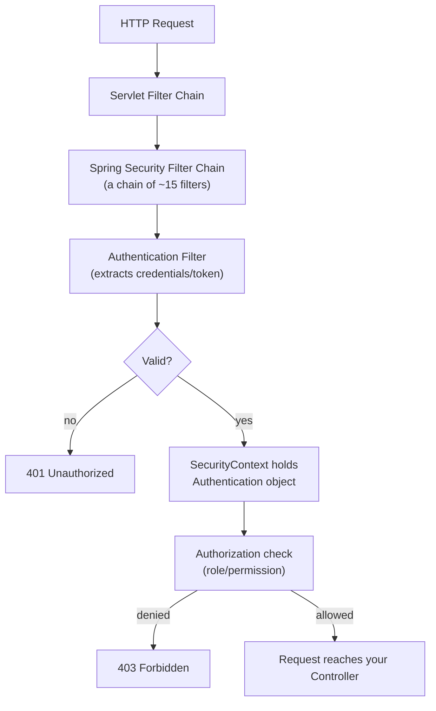
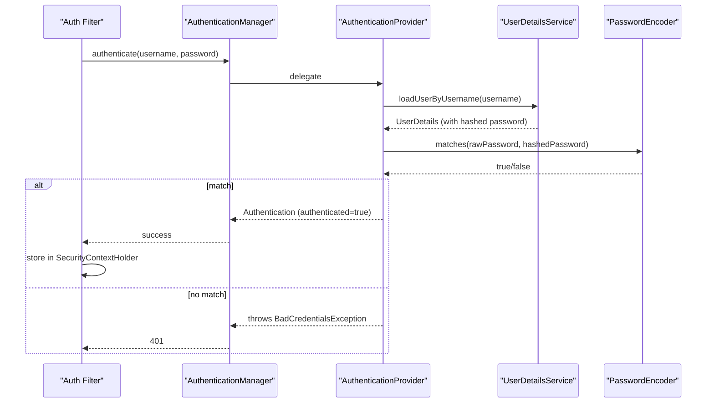
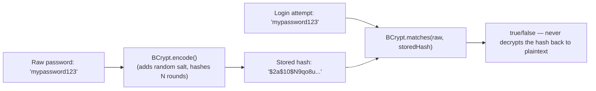
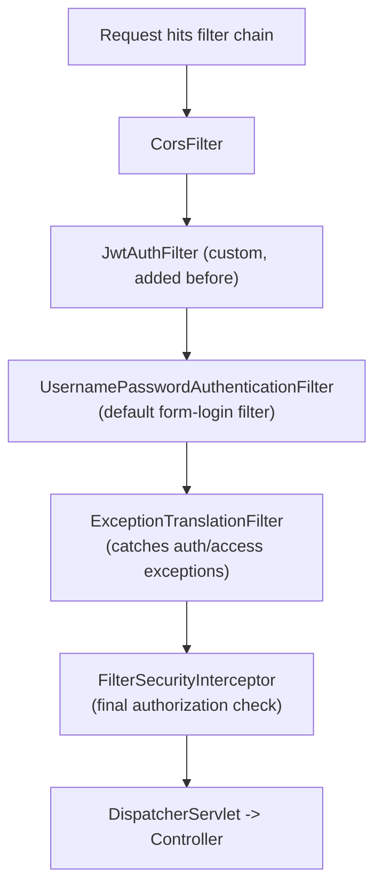
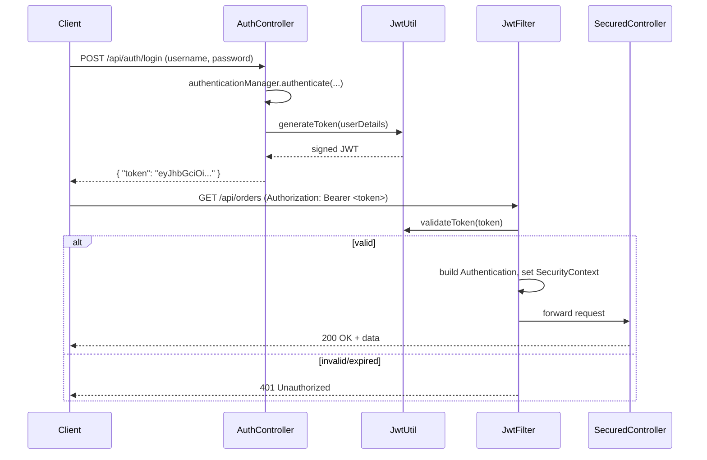
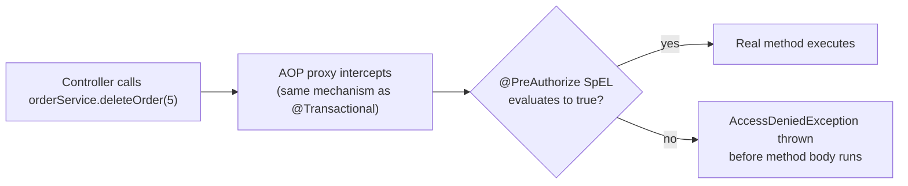
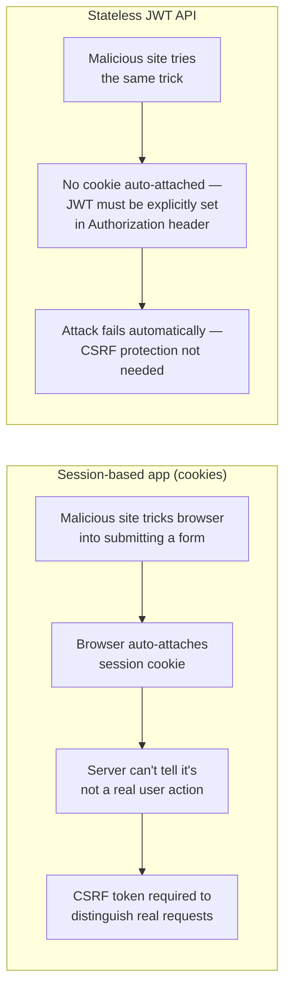
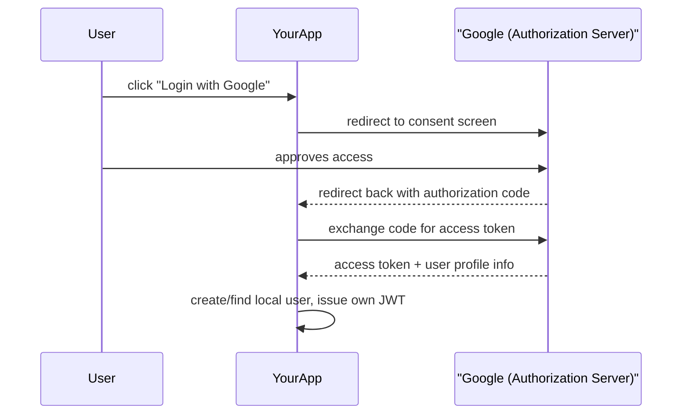
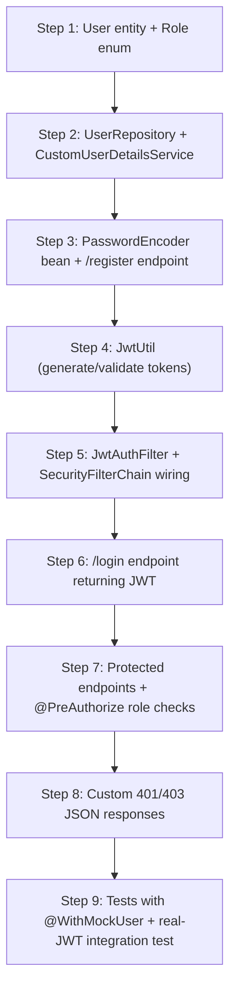

# Spring Security — Complete Guide (Basics to Interview-Ready) + Project

> Format per topic: **What it is -> Diagram -> Code -> Why interviewers ask -> Q&A**
> Final section: a complete JWT auth mini-project tying every topic together.

---

## 1. What Problem Does Spring Security Solve?

Without it, every app would hand-roll: checking credentials, protecting endpoints, hashing passwords, blocking CSRF, managing sessions/tokens. Spring Security is a **filter-chain-based framework** that intercepts every HTTP request *before* it reaches your controller and answers two questions:

1. **Authentication** — who are you? (login, token validation)
2. **Authorization** — what are you allowed to do? (roles/permissions)



**Key mental model:** Spring Security is just a stack of **Servlet Filters** registered in front of your `DispatcherServlet`. Everything else (JWT, OAuth2, form login) is built on this filter chain — once this clicks, the rest of the framework stops feeling like magic.

**Q&A:**
- **Q: Where does Spring Security sit relative to Spring MVC?**
  A: In front of it. It's a chain of servlet filters that runs before the `DispatcherServlet` even sees the request — if auth fails, your controller code never executes.
- **Q: Authentication vs Authorization — one-line difference?**
  A: Authentication = proving who you are. Authorization = deciding what you're allowed to do, checked after authentication succeeds.

---

## 2. Core Building Blocks

| Component | Role |
|---|---|
| `SecurityFilterChain` | The ordered list of filters applied to requests (Spring Boot 3+ way to configure security, replacing `WebSecurityConfigurerAdapter`) |
| `UserDetailsService` | Loads user data (username, password hash, roles) — your bridge to the DB |
| `UserDetails` | Represents the loaded user in a form Spring Security understands |
| `PasswordEncoder` | Hashes and verifies passwords |
| `AuthenticationManager` | Orchestrates the authentication attempt |
| `AuthenticationProvider` | Actual logic that validates credentials |
| `SecurityContext` / `SecurityContextHolder` | Thread-local storage holding the current authenticated user for the duration of the request |



**Q&A:**
- **Q: Why is `UserDetailsService` an interface you implement, not something Spring Boot auto-configures for you?**
  A: Because *where* your user data lives (Postgres, LDAP, an external identity provider) is application-specific — Spring Security only defines the contract (`loadUserByUsername`), you supply the lookup logic.
- **Q: What does `SecurityContextHolder` actually store, and where?**
  A: A `SecurityContext` containing the current `Authentication` object, stored in a `ThreadLocal` by default — that's why it's automatically available anywhere in that request's thread without passing it explicitly, but also why it doesn't survive across threads without extra propagation (e.g., in `@Async` methods).

---

## 3. `UserDetailsService` & `UserDetails`

**What it is:** the contract for loading a user's credentials + authorities from your data source.

```java
@Service
public class CustomUserDetailsService implements UserDetailsService {

    private final UserRepository userRepository;

    public CustomUserDetailsService(UserRepository userRepository) {
        this.userRepository = userRepository;
    }

    @Override
    public UserDetails loadUserByUsername(String username) throws UsernameNotFoundException {
        User user = userRepository.findByUsername(username)
                .orElseThrow(() -> new UsernameNotFoundException("User not found: " + username));

        return org.springframework.security.core.userdetails.User.builder()
                .username(user.getUsername())
                .password(user.getPasswordHash())          // already-hashed value from DB
                .authorities(user.getRoles().stream()
                        .map(SimpleGrantedAuthority::new)
                        .collect(Collectors.toList()))
                .build();
    }
}
```

**Why interviewers ask:** Tests whether you understand that Spring Security never touches your DB directly — you own the lookup, Spring Security owns the verification flow around it.

**Q&A:**
- **Q: What happens if `loadUserByUsername` throws `UsernameNotFoundException`?**
  A: Spring Security treats it the same as bad credentials (to avoid leaking "this username doesn't exist" vs "wrong password" — a user-enumeration security issue) and returns a generic authentication failure.
- **Q: Can you have multiple `UserDetailsService` implementations (e.g., DB users + LDAP users)?**
  A: Yes — you'd typically compose them or pick one per `AuthenticationProvider`, since each provider can be configured with its own `UserDetailsService`.

---

## 4. Password Handling — `PasswordEncoder`

**Never store plain-text passwords.** `BCryptPasswordEncoder` is the standard choice — slow, salted, adaptive hashing designed to resist brute-force.

```java
@Bean
public PasswordEncoder passwordEncoder() {
    return new BCryptPasswordEncoder(); // default strength 10
}

// Registration flow
public void register(String username, String rawPassword) {
    String hashed = passwordEncoder.encode(rawPassword);
    userRepository.save(new User(username, hashed));
}
```



**Q&A:**
- **Q: Why is BCrypt preferred over MD5/SHA-256 for passwords?**
  A: MD5/SHA are fast general-purpose hashes — fast is bad for passwords, since it makes brute-forcing/rainbow-table attacks cheap. BCrypt is deliberately slow and includes a per-password salt, making large-scale cracking attempts computationally expensive.
- **Q: Can you decrypt a BCrypt hash to recover the original password?**
  A: No — hashing is one-way. Login verification works by re-hashing the input and comparing hashes (`matches()`), never by reversing the stored hash.
- **Q: What does the "strength" parameter in `new BCryptPasswordEncoder(12)` control?**
  A: The number of hashing rounds (as a power of 2) — higher strength means slower hashing, which is a deliberate security/performance trade-off tuned based on acceptable login latency.

---

## 5. `SecurityFilterChain` Configuration (Spring Boot 3+ style)

**What it is:** the modern way to configure Spring Security — a `@Bean` returning a `SecurityFilterChain`, replacing the old `WebSecurityConfigurerAdapter` (deprecated/removed in Spring Security 6 / Boot 3).

```java
@Configuration
@EnableWebSecurity
public class SecurityConfig {

    @Bean
    public SecurityFilterChain filterChain(HttpSecurity http) throws Exception {
        http
            .csrf(csrf -> csrf.disable())                          // stateless API -> no CSRF needed
            .sessionManagement(sm -> sm.sessionCreationPolicy(SessionCreationPolicy.STATELESS))
            .authorizeHttpRequests(auth -> auth
                .requestMatchers("/api/auth/**").permitAll()
                .requestMatchers("/api/admin/**").hasRole("ADMIN")
                .requestMatchers(HttpMethod.GET, "/api/products/**").permitAll()
                .anyRequest().authenticated())
            .exceptionHandling(ex -> ex
                .authenticationEntryPoint(customEntryPoint)
                .accessDeniedHandler(customAccessDeniedHandler))
            .addFilterBefore(jwtAuthFilter, UsernamePasswordAuthenticationFilter.class);

        return http.build();
    }

    @Bean
    public AuthenticationManager authenticationManager(AuthenticationConfiguration config) throws Exception {
        return config.getAuthenticationManager();
    }
}
```



**Why interviewers ask:** `WebSecurityConfigurerAdapter` deprecation is a very common "do you keep up with the framework" question — if you only learned from an old tutorial, this is where it shows.

**Q&A:**
- **Q: Why was `WebSecurityConfigurerAdapter` deprecated?**
  A: It encouraged inheritance-based configuration (extending a class and overriding `configure()`), which Spring moved away from in favor of composition — defining a `SecurityFilterChain` as a `@Bean` is more testable, more explicit, and lets you register multiple chains for different URL patterns.
- **Q: What does `sessionCreationPolicy(STATELESS)` actually do?**
  A: Tells Spring Security never to create or use an `HttpSession` for authentication state — required for JWT-based auth, where the token itself (not a server-side session) carries identity on every request.
- **Q: `addFilterBefore` vs `addFilterAfter` — why does filter order matter here?**
  A: Your custom `JwtAuthFilter` must run *before* `UsernamePasswordAuthenticationFilter` so it can populate the `SecurityContext` from the JWT before Spring Security's default authorization checks run later in the chain.

---

## 6. JWT Authentication — Full Deep Dive

This is the single most-asked practical Spring Security topic at your experience level.



**6.1 — JWT utility (generate + validate):**
```java
@Component
public class JwtUtil {
    @Value("${jwt.secret}")
    private String secret;
    @Value("${jwt.expiration-ms}")
    private long expirationMs;

    public String generateToken(UserDetails userDetails) {
        return Jwts.builder()
                .setSubject(userDetails.getUsername())
                .claim("roles", userDetails.getAuthorities())
                .setIssuedAt(new Date())
                .setExpiration(new Date(System.currentTimeMillis() + expirationMs))
                .signWith(Keys.hmacShaKeyFor(secret.getBytes()), SignatureAlgorithm.HS256)
                .compact();
    }

    public String extractUsername(String token) {
        return parseClaims(token).getSubject();
    }

    public boolean isTokenValid(String token, UserDetails userDetails) {
        String username = extractUsername(token);
        return username.equals(userDetails.getUsername()) && !isExpired(token);
    }

    private boolean isExpired(String token) {
        return parseClaims(token).getExpiration().before(new Date());
    }

    private Claims parseClaims(String token) {
        return Jwts.parserBuilder()
                .setSigningKey(Keys.hmacShaKeyFor(secret.getBytes()))
                .build()
                .parseClaimsJws(token)
                .getBody();
    }
}
```

**6.2 — The filter that runs on every request:**
```java
@Component
public class JwtAuthFilter extends OncePerRequestFilter {

    private final JwtUtil jwtUtil;
    private final UserDetailsService userDetailsService;

    @Override
    protected void doFilterInternal(HttpServletRequest request, HttpServletResponse response,
                                     FilterChain filterChain) throws ServletException, IOException {

        String authHeader = request.getHeader("Authorization");
        if (authHeader == null || !authHeader.startsWith("Bearer ")) {
            filterChain.doFilter(request, response);
            return;
        }

        String token = authHeader.substring(7);
        String username = jwtUtil.extractUsername(token);

        if (username != null && SecurityContextHolder.getContext().getAuthentication() == null) {
            UserDetails userDetails = userDetailsService.loadUserByUsername(username);
            if (jwtUtil.isTokenValid(token, userDetails)) {
                UsernamePasswordAuthenticationToken authToken =
                        new UsernamePasswordAuthenticationToken(userDetails, null, userDetails.getAuthorities());
                authToken.setDetails(new WebAuthenticationDetailsSource().buildDetails(request));
                SecurityContextHolder.getContext().setAuthentication(authToken);
            }
        }
        filterChain.doFilter(request, response);
    }
}
```

**6.3 — Login endpoint:**
```java
@RestController
@RequestMapping("/api/auth")
public class AuthController {
    private final AuthenticationManager authenticationManager;
    private final JwtUtil jwtUtil;
    private final UserDetailsService userDetailsService;

    @PostMapping("/login")
    public ResponseEntity<AuthResponse> login(@RequestBody AuthRequest request) {
        authenticationManager.authenticate(
                new UsernamePasswordAuthenticationToken(request.getUsername(), request.getPassword()));
        // if authenticate() doesn't throw, credentials are valid
        UserDetails userDetails = userDetailsService.loadUserByUsername(request.getUsername());
        String token = jwtUtil.generateToken(userDetails);
        return ResponseEntity.ok(new AuthResponse(token));
    }
}
```

**JWT structure recap:** `header.payload.signature` — payload is **Base64-encoded, not encrypted** (anyone can decode and read it), so never put secrets in claims. Signature proves it wasn't tampered with.

**Why interviewers ask:** Nearly every product company uses token-based auth for APIs now — this is the practical, hands-on question they use to check if you've actually *built* auth, not just read about it.

**Q&A:**
- **Q: Why does `JwtAuthFilter` extend `OncePerRequestFilter` instead of a plain `Filter`?**
  A: `OncePerRequestFilter` guarantees the filter's logic runs exactly once per request, even in servlet environments with internal forwards/includes that could otherwise re-invoke a plain filter multiple times per request.
- **Q: Since JWT is stateless, how do you handle logout / token revocation?**
  A: Pure JWT has no built-in revocation. Common approaches: short-lived access tokens + refresh tokens, or a server-side blocklist (often Redis, keyed by token ID with TTL matching remaining token life) checked on each request.
- **Q: What happens if someone tampers with the JWT payload (e.g., changes `roles` to `ADMIN`)?**
  A: The signature check fails during `parseClaimsJws()` — since the signature is computed over header+payload with a secret key only the server knows, any payload modification invalidates the signature and the token is rejected before reaching business logic.
- **Q: Access token vs refresh token — why both?**
  A: Access token is short-lived (minutes) and sent on every API call — limits damage if leaked. Refresh token is long-lived, stored more carefully, and used only to mint new access tokens — reduces how often the long-lived credential travels over the wire.

---

## 7. Method-Level Security

**What it is:** authorization checks at the method level (service layer), not just URL-pattern-based (controller layer) — useful for finer-grained business rules.

```java
@Configuration
@EnableMethodSecurity   // enables @PreAuthorize, @PostAuthorize, @Secured
public class MethodSecurityConfig { }

@Service
public class OrderService {

    @PreAuthorize("hasRole('ADMIN')")
    public void deleteOrder(Long orderId) { }

    @PreAuthorize("#userId == authentication.principal.id")   // only the owning user
    public Order getOrder(Long userId, Long orderId) { ... }

    @PostAuthorize("returnObject.ownerId == authentication.principal.id")
    public Order findOrder(Long orderId) { ... }   // checked AFTER method runs, on the return value
}
```



**Why interviewers ask:** Tests whether you know authorization isn't only "which URLs are protected" — real systems need per-record ownership checks (e.g., "can this user only see *their own* orders"), which URL matching alone can't express.

**Q&A:**
- **Q: `@PreAuthorize` vs `@PostAuthorize`?**
  A: `@PreAuthorize` evaluates before the method runs (can block execution entirely, cheaper). `@PostAuthorize` evaluates after the method runs, with access to the return value via `returnObject` — needed when the authorization decision depends on data the method itself fetches.
- **Q: How is `@PreAuthorize` implemented under the hood?**
  A: Same mechanism as `@Transactional` — an AOP proxy wraps the bean; the proxy evaluates the SpEL expression before delegating to the real method.
- **Q: What's the security risk of relying only on `@PreAuthorize` and skipping URL-level checks in `SecurityFilterChain`?**
  A: None inherently, but layering both is defense-in-depth — URL-level rules catch broad category mistakes early (before touching the service layer), while method-level rules handle fine-grained/ownership logic URL patterns can't express.

---

## 8. CORS & CSRF

**CORS (Cross-Origin Resource Sharing):** browser-enforced restriction on which origins (domains) can call your API from client-side JS. You configure it server-side to *allow* specific origins.

```java
@Bean
public CorsConfigurationSource corsConfigurationSource() {
    CorsConfiguration config = new CorsConfiguration();
    config.setAllowedOrigins(List.of("https://myfrontend.com"));
    config.setAllowedMethods(List.of("GET", "POST", "PUT", "DELETE"));
    config.setAllowedHeaders(List.of("Authorization", "Content-Type"));
    config.setAllowCredentials(true);

    UrlBasedCorsConfigurationSource source = new UrlBasedCorsConfigurationSource();
    source.registerCorsConfiguration("/**", config);
    return source;
}
```

**CSRF (Cross-Site Request Forgery):** an attack tricking a logged-in user's browser into making an unwanted request (relies on the browser auto-sending cookies). Spring Security enables CSRF protection by default for stateful (session/cookie-based) apps.



**Why interviewers ask:** Very commonly tests whether you can explain *why* you disabled CSRF in your JWT config, rather than just having copy-pasted `.csrf().disable()` without understanding it.

**Q&A:**
- **Q: Why is it safe to disable CSRF for a JWT-based stateless API but not for a session-based app?**
  A: CSRF exploits the browser's automatic cookie attachment on cross-origin requests. A JWT sent via an explicit `Authorization` header isn't auto-attached by the browser — a malicious site can't force the victim's browser to include it — so the attack vector doesn't apply the same way.
- **Q: Is CORS a security *protection* or a security *relaxation*?**
  A: A relaxation — the browser blocks cross-origin requests by default (Same-Origin Policy); CORS config explicitly *permits* certain origins through. Misconfiguring `allowedOrigins("*")` with credentials is a common real vulnerability.
- **Q: Can CORS protect your API from non-browser clients (e.g., Postman, curl, another server)?**
  A: No — CORS is a browser-enforced mechanism. Non-browser clients aren't bound by it, so CORS is not a substitute for actual authentication/authorization.

---

## 9. Exception Handling in Security

**What it is:** custom responses for authentication failures (401) and authorization failures (403), since Spring Security's defaults return generic HTML error pages, not JSON.

```java
@Component
public class CustomAuthEntryPoint implements AuthenticationEntryPoint {
    @Override
    public void commence(HttpServletRequest req, HttpServletResponse res, AuthenticationException ex)
            throws IOException {
        res.setStatus(HttpServletResponse.SC_UNAUTHORIZED);
        res.setContentType("application/json");
        res.getWriter().write("{\"error\": \"Unauthorized\", \"message\": \"" + ex.getMessage() + "\"}");
    }
}

@Component
public class CustomAccessDeniedHandler implements AccessDeniedHandler {
    @Override
    public void handle(HttpServletRequest req, HttpServletResponse res, AccessDeniedException ex)
            throws IOException {
        res.setStatus(HttpServletResponse.SC_FORBIDDEN);
        res.setContentType("application/json");
        res.getWriter().write("{\"error\": \"Forbidden\", \"message\": \"You don't have permission\"}");
    }
}
```

**Why interviewers ask:** Real APIs need consistent JSON error contracts — this checks awareness that Spring Security's default error handling doesn't fit REST APIs out of the box.

**Q&A:**
- **Q: `AuthenticationEntryPoint` vs `AccessDeniedHandler` — when does each fire?**
  A: `AuthenticationEntryPoint` fires when there's no valid authentication at all (401 case — "who are you?"). `AccessDeniedHandler` fires when the user *is* authenticated but lacks permission for the resource (403 case — "I know who you are, but you can't do this").
- **Q: Why can't you just use your `@RestControllerAdvice` global exception handler for these?**
  A: Security exceptions are thrown from within the filter chain, *before* the request reaches `DispatcherServlet`/controller layer — `@ExceptionHandler` methods only catch exceptions thrown during controller execution, so they never see filter-chain-level auth failures.

---

## 10. OAuth2 / Social Login (Awareness Level)

**What it is:** delegated authorization — letting users log in via Google/GitHub/etc. without your app ever seeing their password. Less commonly asked in depth at 1.5 YOE, but you should know the shape of it.



```java
// application.yml
spring:
  security:
    oauth2:
      client:
        registration:
          google:
            client-id: ${GOOGLE_CLIENT_ID}
            client-secret: ${GOOGLE_CLIENT_SECRET}
            scope: profile,email
```

**Q&A:**
- **Q: What's the difference between OAuth2 and OpenID Connect (OIDC)?**
  A: OAuth2 is an *authorization* framework (delegated access to resources — "let this app read my Google Drive"). OIDC is a thin identity layer built on top of OAuth2 specifically for *authentication* ("who is this user") — it adds the ID token concept.
- **Q: Why would you still issue your own JWT after a successful OAuth2 login, instead of just using Google's token?**
  A: Your API shouldn't couple its session/auth format to a third-party provider's token structure or lifetime — issuing your own JWT keeps your API's auth mechanism consistent regardless of login method (password, Google, GitHub, etc.).

---

## 11. Testing Secured Endpoints

```java
@WebMvcTest(OrderController.class)
class OrderControllerSecurityTest {
    @Autowired private MockMvc mockMvc;
    @MockBean private OrderService orderService;

    @Test
    @WithMockUser(roles = "USER")
    void authenticatedUserCanAccess() throws Exception {
        mockMvc.perform(get("/api/orders")).andExpect(status().isOk());
    }

    @Test
    void unauthenticatedRequestIsRejected() throws Exception {
        mockMvc.perform(get("/api/orders")).andExpect(status().isUnauthorized());
    }

    @Test
    @WithMockUser(roles = "USER")
    void nonAdminCannotDelete() throws Exception {
        mockMvc.perform(delete("/api/orders/1")).andExpect(status().isForbidden());
    }
}
```

**Q&A:**
- **Q: What does `@WithMockUser` actually do?**
  A: Populates the `SecurityContext` with a mock `Authentication` for the duration of the test, so you can test authorization rules (`@PreAuthorize`, `hasRole()`) without standing up a real login flow or a real JWT.
- **Q: How would you test the actual JWT filter logic itself, not just the controller's authorization rules?**
  A: A more integration-style test — `@SpringBootTest` with `MockMvc`, generating a real JWT via your `JwtUtil` in the test setup and passing it in the `Authorization` header, verifying the filter correctly populates the `SecurityContext` end-to-end.

---

## 12. Quick Reference — Properties & Annotations

```yaml
# JWT
jwt.secret: <256-bit-secret-key>
jwt.expiration-ms: 3600000

# OAuth2 client
spring.security.oauth2.client.registration.google.client-id: ...
spring.security.oauth2.client.registration.google.client-secret: ...

# Disable default security auto-config (rare, advanced)
spring.autoconfigure.exclude: org.springframework.boot.autoconfigure.security.servlet.SecurityAutoConfiguration
```

| Annotation | Purpose |
|---|---|
| `@EnableWebSecurity` | Enables Spring Security's web security support |
| `@EnableMethodSecurity` | Enables `@PreAuthorize`/`@PostAuthorize`/`@Secured` |
| `@PreAuthorize` / `@PostAuthorize` | Method-level authorization via SpEL |
| `@Secured` | Simpler role-based method security (no SpEL) |
| `@WithMockUser` | Test annotation — simulates an authenticated user |
| `@AuthenticationPrincipal` | Injects the current authenticated `UserDetails` into a controller method |

---

# 13. Build-Along Project: JWT Authentication Service

This ties every topic above into one working system. Build it in this order — each step exercises a different topic from above.



**Project structure:**
```
src/main/java/com/example/authdemo/
├── entity/
│   ├── User.java              (username, passwordHash, Set<Role> roles)
│   └── Role.java              (enum: USER, ADMIN)
├── repository/
│   └── UserRepository.java
├── security/
│   ├── CustomUserDetailsService.java
│   ├── JwtUtil.java
│   ├── JwtAuthFilter.java
│   ├── CustomAuthEntryPoint.java
│   ├── CustomAccessDeniedHandler.java
│   └── SecurityConfig.java
├── controller/
│   ├── AuthController.java    (/api/auth/register, /api/auth/login)
│   └── OrderController.java   (protected endpoints to test roles)
├── dto/
│   ├── AuthRequest.java
│   └── AuthResponse.java
└── AuthDemoApplication.java
```

**Suggested build sequence (do this over a few days, not one sitting):**

1. **Day 1 — Entities + DB.** `User` entity, `Role` enum, `UserRepository extends JpaRepository`. Seed one admin and one regular user manually. *(Exercises: JPA entities from your Spring Boot guide.)*
2. **Day 2 — Registration.** `PasswordEncoder` bean, `/api/auth/register` hashing and saving passwords. Verify in DB the password is never stored in plaintext. *(Exercises: topic 4.)*
3. **Day 3 — UserDetailsService.** Wire `CustomUserDetailsService`, confirm Spring Security can load your users. *(Exercises: topic 3.)*
4. **Day 4 — JWT core.** `JwtUtil` — generate and manually decode a token on [jwt.io](https://jwt.io) to see the claims yourself. *(Exercises: topic 6, JWT structure.)*
5. **Day 5 — Filter + login endpoint.** `JwtAuthFilter`, `SecurityFilterChain`, `/api/auth/login`. Test with Postman: login, copy token, call a protected endpoint with `Authorization: Bearer <token>`. *(Exercises: topics 5, 6.)*
6. **Day 6 — Authorization.** Add `@PreAuthorize("hasRole('ADMIN')")` on a delete endpoint. Confirm a `USER`-role token gets 403. *(Exercises: topic 7.)*
7. **Day 7 — Polish + tests.** Custom 401/403 JSON bodies, then `@WebMvcTest` with `@WithMockUser` for authorization rules, plus one real end-to-end JWT test. *(Exercises: topics 9, 11.)*

**Interview payoff:** after building this, "walk me through how JWT auth works in Spring Security" becomes something you can answer by narrating your own filter and your own login endpoint — not reciting theory. That's the difference interviewers are actually listening for at 1.5 YOE.
