# Spring Boot — Complete Interview Guide (1.5 YOE)

> Format per topic: **What it is → Diagram → Why interviewers ask → Q&A**

---

# SECTION 1: CORE CONCEPTS

## 1. IoC & Dependency Injection

**What it is:**
- Normally, your class creates its own dependencies (`new UserService()`). That's tight coupling.
- **Inversion of Control (IoC):** you stop creating objects yourself — a container (Spring) does it for you and hands them to you.
- **Dependency Injection (DI):** the *mechanism* IoC uses — the container "injects" the required objects into your class instead of your class instantiating them.
- The container that does this is the **ApplicationContext** (built on `BeanFactory`).

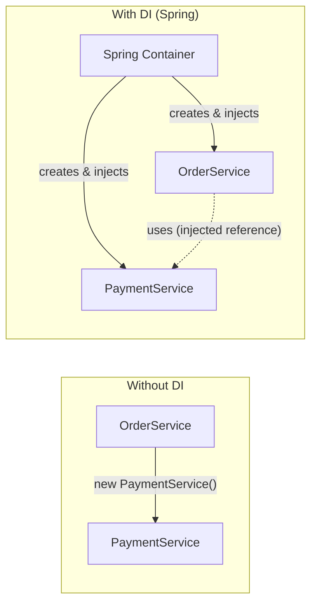

**3 types of DI:**

| Type | How | Recommended? |
|---|---|---|
| Constructor Injection | Dependency passed via constructor | Yes - Spring team's official recommendation |
| Setter Injection | Dependency set via a setter method | Only for optional dependencies |
| Field Injection | @Autowired directly on field | Avoid - hard to test, hides dependencies |

```java
// Constructor Injection (best practice)
@Service
public class OrderService {
    private final PaymentService paymentService;

    public OrderService(PaymentService paymentService) {
        this.paymentService = paymentService;
    }
}
```

**Why constructor injection wins:**
- Enables `final` fields -> immutability
- Fails fast at startup if a bean is missing (not at runtime)
- Makes unit testing trivial (just pass a mock in the constructor, no Spring needed)
- No circular dependency silently working -- it throws an error early, forcing you to fix design

**Why interviewers ask:** It's the single most fundamental Spring concept -- tests if you understand *why* Spring exists, not just how to use `@Autowired`.

**Q&A:**
- **Q: Why is constructor injection preferred over field injection?**
  A: Immutability (final fields), testability without reflection/Spring context, fail-fast on missing beans, and it makes circular dependencies visible instead of masked.
- **Q: Can constructor injection cause a circular dependency issue that field injection doesn't show?**
  A: Yes -- field injection can "resolve" circular deps lazily via reflection post-construction, hiding a design flaw. Constructor injection fails immediately (BeanCurrentlyInCreationException), forcing you to fix the design (e.g., via @Lazy or refactoring).
- **Q: What's the difference between @Autowired and @Inject?**
  A: @Autowired is Spring-specific; @Inject is from javax.inject (JSR-330), a standard Spring also supports. Functionally near-identical, but @Autowired has a required attribute.

---

## 2. Spring Beans & Bean Lifecycle

**What it is:**
- A **bean** is any object managed by the Spring IoC container (created, configured, wired, and destroyed by Spring instead of your code).
- Beans are defined via @Component (and stereotypes @Service, @Repository, @Controller), or via @Bean methods in a @Configuration class.

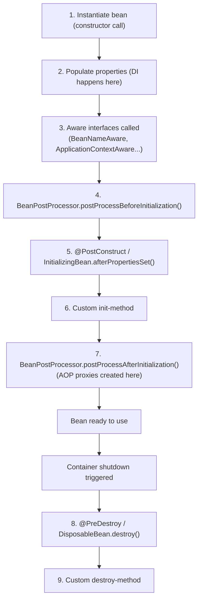

**Bean scopes:**

| Scope | Meaning |
|---|---|
| singleton (default) | One instance per Spring container |
| prototype | New instance every time it's requested |
| request | One instance per HTTP request (web apps) |
| session | One instance per HTTP session |

```java
@Component
public class CacheWarmer {
    @PostConstruct
    public void init() { System.out.println("Bean ready, warm cache now"); }

    @PreDestroy
    public void cleanup() { System.out.println("Bean destroyed, flush cache"); }
}
```

**Why interviewers ask:** Tests whether you understand what Spring is actually doing behind @Component, and whether you know where to hook in initialization logic (very common in real systems -- e.g., warming a Redis cache or validating config on startup, relevant to your Nexus setup).

**Q&A:**
- **Q: What's the default bean scope, and why does it matter for thread safety?**
  A: Singleton -- one shared instance for the whole app. This means beans must be stateless or properly synchronized, since concurrent requests hit the same instance. Never store request-specific mutable state in a singleton field.
- **Q: Difference between @PostConstruct and a constructor?**
  A: Constructor runs before dependencies are injected (in field/setter injection) -- you can't rely on injected fields inside it. @PostConstruct runs after all dependencies are injected, so it's the safe place for initialization logic that needs those dependencies.
- **Q: What is a BeanPostProcessor and where have you seen one used implicitly?**
  A: A hook that lets you modify beans before/after initialization. Spring uses these internally to create AOP proxies (e.g., for @Transactional) -- that's why the object you get back from the container is sometimes a proxy, not your raw class instance.

---

## 3. Auto-Configuration & Starters

**What it is:**
- A "starter" (e.g., spring-boot-starter-web) is a curated dependency bundle -- pulls in everything commonly needed for a use case (Tomcat, Jackson, Spring MVC for -web).
- **Auto-configuration** = Spring Boot inspects what's on the classpath and configures beans automatically, only if you haven't defined your own.

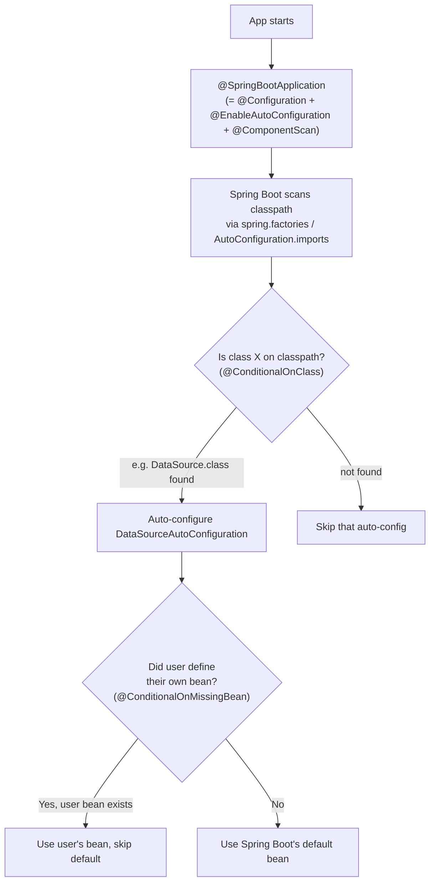

**Key annotations that power this:**
- @ConditionalOnClass -- only apply if a class is on the classpath
- @ConditionalOnMissingBean -- only apply if the user hasn't defined their own
- @ConditionalOnProperty -- only apply if a property is set a certain way

**Why interviewers ask:** This is the thing that differentiates Spring Boot from plain Spring. If you can't explain this, it signals you've only ever used the framework, never understood it.

**Q&A:**
- **Q: How does Spring Boot know to configure a DataSource automatically?**
  A: DataSourceAutoConfiguration is annotated @ConditionalOnClass(DataSource.class) -- if a JDBC driver + DataSource class are on the classpath, and no DataSource bean is manually defined (@ConditionalOnMissingBean), Spring Boot wires one up using application.properties.
- **Q: How do you override an auto-configured bean?**
  A: Define your own @Bean of that type in a @Configuration class -- @ConditionalOnMissingBean means Boot backs off automatically.
- **Q: What's the difference between @SpringBootApplication and @EnableAutoConfiguration?**
  A: @SpringBootApplication is a meta-annotation combining @Configuration, @EnableAutoConfiguration, and @ComponentScan -- one annotation instead of three.

---

# SECTION 2: REST API

## 4. REST Controllers & Mappings

**What it is:**
- @RestController = @Controller + @ResponseBody (return values are serialized directly to the response body, e.g. as JSON, instead of resolving to a view).
- Mapping annotations route HTTP requests to methods.

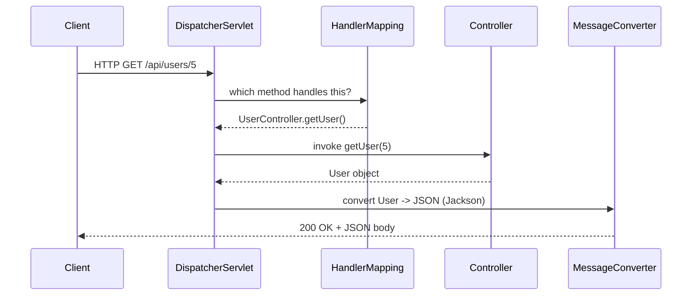

```java
@RestController
@RequestMapping("/api/users")
public class UserController {

    @GetMapping("/{id}")
    public ResponseEntity<UserDto> getUser(@PathVariable Long id) {
        return ResponseEntity.ok(userService.findById(id));
    }

    @PostMapping
    public ResponseEntity<UserDto> create(@RequestBody @Valid UserDto dto) {
        UserDto saved = userService.save(dto);
        return ResponseEntity.status(HttpStatus.CREATED).body(saved);
    }

    @GetMapping
    public List<UserDto> search(@RequestParam(required = false) String name) { }
}
```

**Key distinctions:**
- @PathVariable -- from URI path (/users/5 -> 5)
- @RequestParam -- from query string (?name=sid)
- @RequestBody -- from JSON request body

**Why interviewers ask:** Baseline competency check -- but they'll push into ResponseEntity usage and proper status codes, which separates juniors from people who've actually shipped APIs.

**Q&A:**
- **Q: Why return ResponseEntity<T> instead of just T?**
  A: T alone always returns 200. ResponseEntity lets you control status code, headers, and body explicitly -- needed for 201 Created, 204 No Content, custom headers, etc.
- **Q: What HTTP status should POST return on success, and why not 200?**
  A: 201 Created -- semantically correct since a resource was created; convention also expects a Location header pointing to the new resource.
- **Q: Is @RequestMapping on the class combinable with method-level @GetMapping?**
  A: Yes -- class-level @RequestMapping("/api/users") is the base path, prefixed to each method's mapping.

---

## 5. Global Exception Handling

**What it is:**
- Instead of try-catch in every controller method, @RestControllerAdvice + @ExceptionHandler centralizes error handling for the whole app.

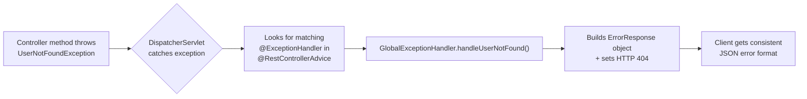

```java
@RestControllerAdvice
public class GlobalExceptionHandler {

    @ExceptionHandler(UserNotFoundException.class)
    public ResponseEntity<ErrorResponse> handleNotFound(UserNotFoundException ex) {
        ErrorResponse error = new ErrorResponse("USER_NOT_FOUND", ex.getMessage());
        return ResponseEntity.status(HttpStatus.NOT_FOUND).body(error);
    }

    @ExceptionHandler(MethodArgumentNotValidException.class)
    public ResponseEntity<ErrorResponse> handleValidation(MethodArgumentNotValidException ex) {
        return ResponseEntity.badRequest().body(buildFieldErrors(ex));
    }

    @ExceptionHandler(Exception.class)
    public ResponseEntity<ErrorResponse> handleGeneric(Exception ex) {
        return ResponseEntity.internalServerError().body(new ErrorResponse("INTERNAL_ERROR", "Something went wrong"));
    }
}
```

**Why interviewers ask:** Real production APIs need consistent error contracts. This question also probes whether you know exception hierarchy design (custom exceptions vs generic ones).

**Q&A:**
- **Q: What's the difference between @ControllerAdvice and @RestControllerAdvice?**
  A: Same as @Controller vs @RestController -- the latter adds @ResponseBody implicitly so returned objects serialize to JSON directly.
- **Q: How do you handle multiple exception types with one handler?**
  A: @ExceptionHandler({TypeA.class, TypeB.class}) on one method, or catch a common parent exception class.
- **Q: Should you expose the raw exception message/stack trace to the client?**
  A: No -- for a generic 500, return a safe generic message and log the full stack trace server-side. Leaking internals is a security concern.

---

## 6. Input Validation

**What it is:**
- Bean Validation (JSR-380 / Hibernate Validator) lets you declare constraints on DTO fields; @Valid triggers validation at the controller boundary.

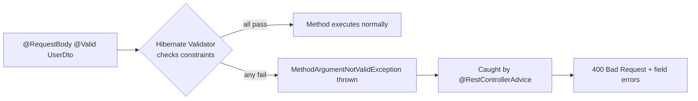

```java
public class UserDto {
    @NotBlank(message = "Name is required")
    private String name;

    @Email
    private String email;

    @Min(18) @Max(120)
    private int age;

    @Pattern(regexp = "^[0-9]{10}$")
    private String phone;
}

@PostMapping
public ResponseEntity<?> create(@RequestBody @Valid UserDto dto) { }
```

**Common annotations:** @NotNull, @NotBlank, @NotEmpty, @Size, @Min/@Max, @Email, @Pattern, @Positive, @Past/@Future.

**Why interviewers ask:** Everyone writes validation, but few can explain @NotNull vs @NotBlank vs @NotEmpty, or how to build custom constraints -- good differentiator question.

**Q&A:**
- **Q: @NotNull vs @NotBlank vs @NotEmpty?**
  A: @NotNull -- not null (empty string "" passes). @NotEmpty -- not null and not empty (but "  " passes). @NotBlank -- not null, not empty, and not just whitespace. Use @NotBlank for Strings that must have real content.
- **Q: How do you validate nested objects (a DTO containing another DTO)?**
  A: Annotate the nested field with @Valid too -- validation doesn't cascade automatically.
- **Q: How do you create a custom validation annotation?**
  A: Create annotation + implement ConstraintValidator<YourAnnotation, FieldType> with isValid() logic.

---

# SECTION 3: SPRING DATA JPA

## 7. JPA Entities & Relationships

**What it is:**
- @Entity maps a Java class to a DB table. JPA (via Hibernate) manages the object-relational mapping.

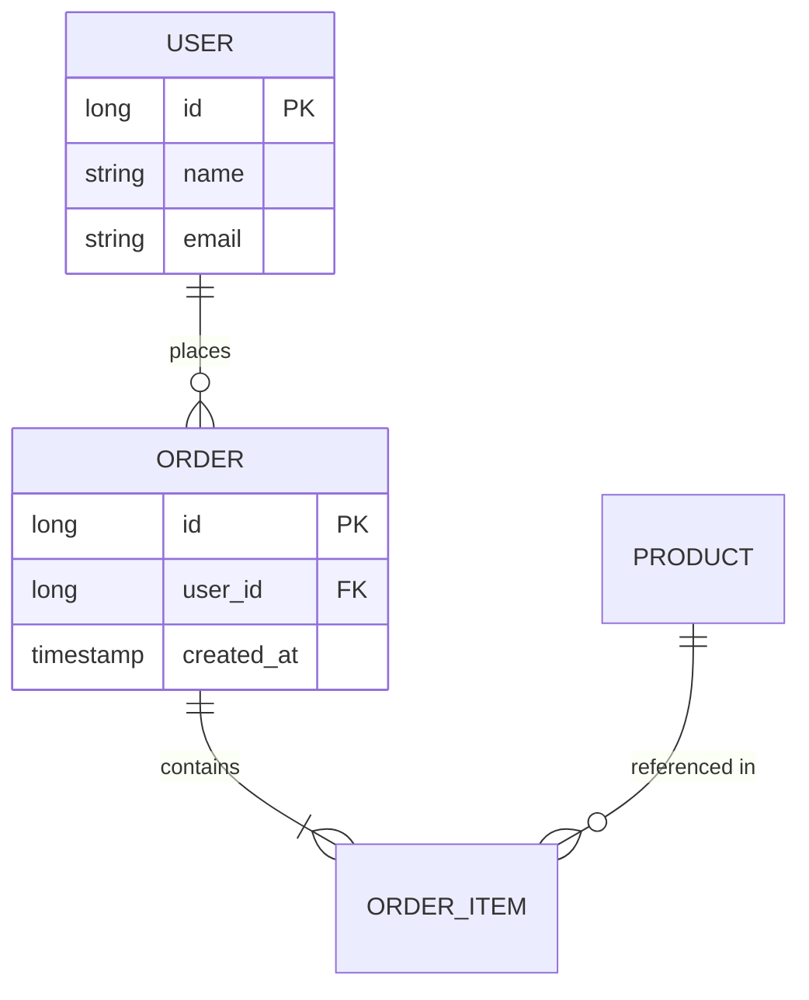

```java
@Entity
@Table(name = "orders")
public class Order {
    @Id @GeneratedValue(strategy = GenerationType.IDENTITY)
    private Long id;

    @ManyToOne(fetch = FetchType.LAZY)
    @JoinColumn(name = "user_id")
    private User user;

    @OneToMany(mappedBy = "order", cascade = CascadeType.ALL, orphanRemoval = true)
    private List<OrderItem> items = new ArrayList<>();
}
```

**Relationship types:** @OneToOne, @OneToMany, @ManyToOne, @ManyToMany. Default fetch: @ManyToOne/@OneToOne = EAGER; @OneToMany/@ManyToMany = LAZY.

**Why interviewers ask:** ORM mapping mistakes cause real production bugs (accidental cascading deletes, N+1s, memory bloat from EAGER fetch). This tests design judgment, not just syntax.

**Q&A:**
- **Q: Why should you almost always override the default fetch type to LAZY?**
  A: EAGER loads related entities immediately even when unneeded, causing unnecessary joins/queries and potential performance issues at scale. LAZY loads on-demand -- fetch explicitly when you actually need the data.
- **Q: What does mappedBy mean?**
  A: Marks the inverse (non-owning) side of a bidirectional relationship -- tells JPA "the foreign key is managed by the other entity's field," preventing a duplicate join table/column.
- **Q: CascadeType.ALL vs orphanRemoval = true?**
  A: Cascade propagates operations (persist, merge, remove) from parent to children. orphanRemoval additionally deletes a child when it's removed from the parent's collection, even without an explicit delete call.

---

## 8. Spring Data JPA Repository

**What it is:**
- Extend JpaRepository<Entity, IdType> and get CRUD + pagination + sorting for free -- no implementation needed.
- Spring generates queries from method names, or you write custom ones.

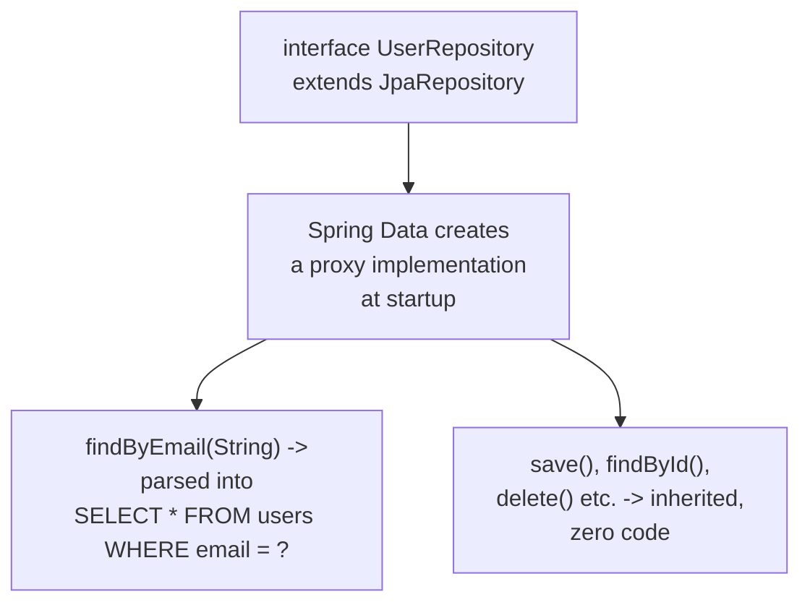

```java
public interface UserRepository extends JpaRepository<User, Long> {
    Optional<User> findByEmail(String email);
    List<User> findByAgeGreaterThanAndNameContaining(int age, String name);

    @Query("SELECT u FROM User u WHERE u.status = :status")
    List<User> findActiveUsers(@Param("status") String status);

    @Query(value = "SELECT * FROM users WHERE email = ?1", nativeQuery = true)
    User findByEmailNative(String email);
}
```

**Why interviewers ask:** Almost every backend role uses Spring Data JPA -- expect at least one question on method-name query derivation vs @Query, and when to drop to native SQL.

**Q&A:**
- **Q: When would you use @Query instead of derived method names?**
  A: When the method name would get unreadably long, when you need JOIN FETCH to solve N+1, or for complex conditions that don't map cleanly to naming conventions.
- **Q: JPQL vs native query -- when do you need nativeQuery = true?**
  A: JPQL operates on entity/field names and is DB-agnostic. Use native SQL when you need DB-specific functions, complex window functions, or performance-tuned raw SQL JPQL can't express.
- **Q: What does JpaRepository give you over CrudRepository?**
  A: JpaRepository extends PagingAndSortingRepository and CrudRepository, adding batch operations (saveAll, flush, deleteAllInBatch) and JPA-specific methods.

---

## 9. @Transactional Deep Dive

**What it is:**
- @Transactional wraps a method in a database transaction -- either all DB operations succeed (commit) or all roll back.
- Implemented via AOP proxy: Spring wraps your bean in a proxy that opens a transaction before the method and commits/rolls back after.

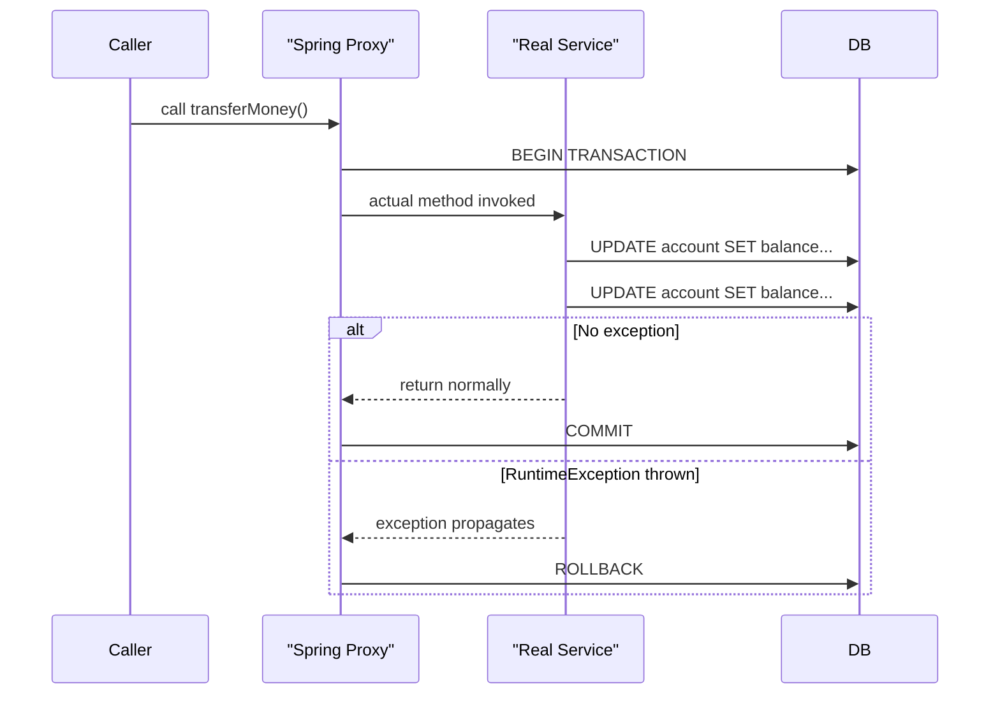

**Critical gotcha -- self-invocation bypasses the proxy:**
```java
@Service
public class OrderService {
    public void placeOrder() {
        this.saveOrder(); // @Transactional on saveOrder() is IGNORED
                           // because 'this' bypasses the proxy entirely
    }
    @Transactional
    public void saveOrder() { }
}
```

**Propagation types (most asked):**

| Type | Behavior |
|---|---|
| REQUIRED (default) | Join existing transaction, or create new one |
| REQUIRES_NEW | Always suspend current tx, start a brand-new one |
| NESTED | Nested tx with savepoint -- can roll back independently |
| SUPPORTS | Join if one exists, else run non-transactionally |
| MANDATORY | Must run within existing tx, else throw exception |

**Why interviewers ask:** This is a classic "separates 6-month experience from 2-year experience" topic -- the self-invocation trap and checked-vs-unchecked rollback rules catch almost everyone who hasn't been burned by them in production.

**Q&A:**
- **Q: Why does @Transactional not roll back by default on a checked exception?**
  A: Spring's default rollback rule only triggers on RuntimeException and Error. Checked exceptions are treated as "expected" business outcomes unless you explicitly configure rollbackFor = Exception.class.
- **Q: Why doesn't @Transactional work when called from another method in the same class?**
  A: Spring AOP proxies only intercept calls that go through the proxy object -- an internal this.method() call bypasses the proxy, so no transactional interception happens. Fix: inject a self-reference bean, move the method to another bean, or use AopContext.currentProxy().
- **Q: Difference between REQUIRED and REQUIRES_NEW?**
  A: REQUIRED joins the caller's transaction (one rollback affects both). REQUIRES_NEW suspends the caller's tx and starts an independent one -- useful for things like audit logging that should persist even if the outer transaction rolls back.

---

## 10. N+1 Problem & Solutions

**What it is:**
- Classic ORM performance bug: fetching N parent rows triggers 1 query for the parents + N additional queries for each parent's lazy-loaded children = N+1 total queries.

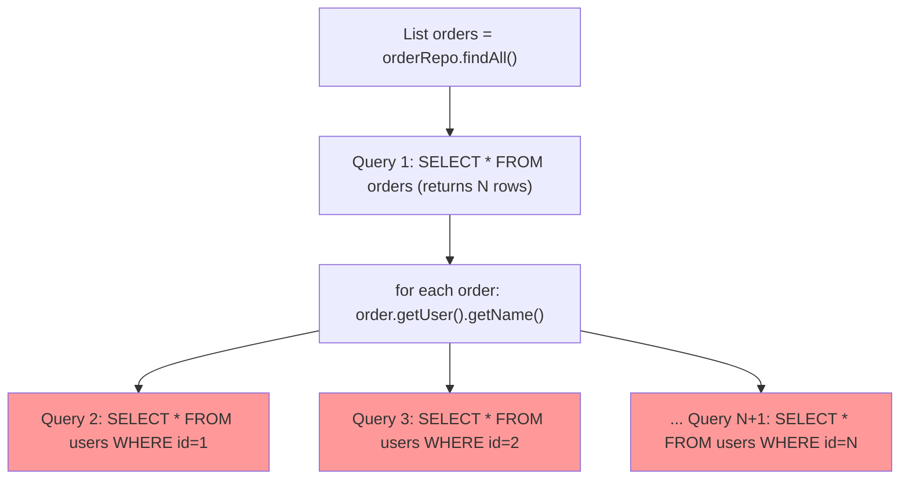

**Solutions:**

```java
// 1. JOIN FETCH (most common fix)
@Query("SELECT o FROM Order o JOIN FETCH o.user WHERE o.status = :status")
List<Order> findWithUser(@Param("status") String status);

// 2. @EntityGraph (declarative, avoids writing JPQL)
@EntityGraph(attributePaths = {"user", "items"})
List<Order> findByStatus(String status);

// 3. Batch fetching (fetches in batches of N instead of 1-by-1)
// application.properties: spring.jpa.properties.hibernate.default_batch_fetch_size=50
```

**Why interviewers ask:** This is the most common real-world Spring Boot performance interview question. If you can explain this with confidence, it signals production experience, not tutorial-following.

**Q&A:**
- **Q: How do you detect an N+1 problem in practice?**
  A: Enable spring.jpa.show-sql=true (or better, a query-count assertion in tests / a tool like p6spy) and watch for repeated single-row SELECT statements after a list fetch. In production, tools like Hibernate statistics or APM traces reveal it.
- **Q: JOIN FETCH vs @EntityGraph -- when would you pick one over the other?**
  A: JOIN FETCH gives full control (custom JPQL, conditions), but you must add it to every query manually. @EntityGraph is declarative and reusable across repository methods without rewriting JPQL -- good default for simple "always fetch this association" cases.
- **Q: Can JOIN FETCH cause problems with pagination?**
  A: Yes -- fetching a @OneToMany collection with JOIN FETCH + Pageable triggers a Hibernate warning and does in-memory pagination (loads everything then pages), which defeats the purpose. Fix: use @EntityGraph with a subquery approach, or paginate parent IDs first then fetch details separately.

---

## 11. Pagination & Sorting

**What it is:**
- Pageable + Page<T> give you offset-based pagination and sorting for free through Spring Data.

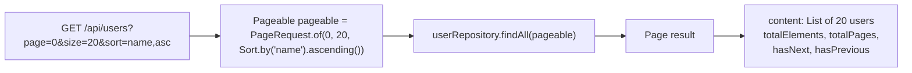

```java
@GetMapping
public Page<UserDto> getUsers(
        @RequestParam(defaultValue = "0") int page,
        @RequestParam(defaultValue = "20") int size,
        @RequestParam(defaultValue = "id") String sortBy) {

    Pageable pageable = PageRequest.of(page, size, Sort.by(sortBy).ascending());
    return userRepository.findAll(pageable).map(this::toDto);
}
```

**Why interviewers ask:** Every list endpoint in production needs pagination -- testing if you know it's built-in, not something to hand-roll with LIMIT/OFFSET yourself.

**Q&A:**
- **Q: Page<T> vs Slice<T> -- what's the difference?**
  A: Page runs an extra COUNT query to know total pages/elements (more expensive). Slice only knows if there's a next page (cheaper -- no count query) -- good when you don't need total counts, e.g., infinite scroll.
- **Q: Why is offset-based pagination (LIMIT/OFFSET) inefficient for very large datasets?**
  A: The DB still has to scan and skip all preceding rows before returning the page, so deep pages (page=10000) get progressively slower. Keyset/cursor pagination (WHERE id > lastSeenId LIMIT N) avoids this.
- **Q: How would you expose sortable fields safely, without letting the client sort by any arbitrary column?**
  A: Whitelist the allowed sort fields server-side rather than passing the raw sortBy param straight into Sort.by() -- otherwise you risk exposing internal column names or enabling inefficient sorts on non-indexed columns.

---

# SECTION 4: CONFIGURATION

## 12. Application Configuration

**What it is:**
- Externalized config via application.properties/application.yml, environment variables, command-line args -- read into your code via @Value or type-safe @ConfigurationProperties.

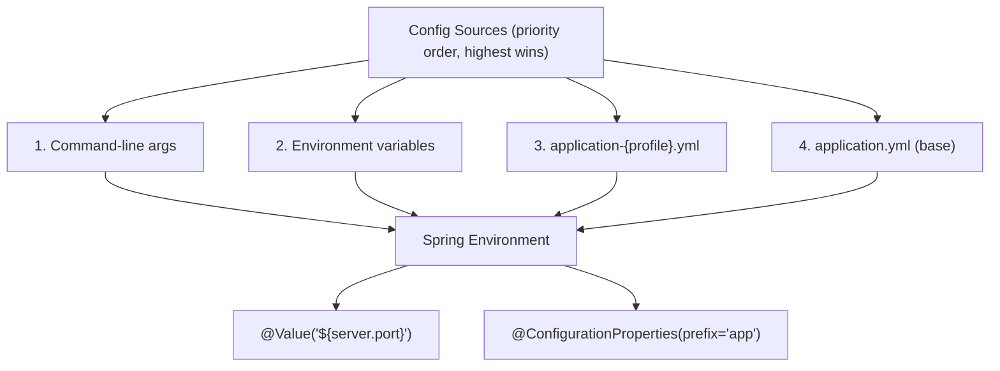

```java
@ConfigurationProperties(prefix = "app.kafka")
@Component
public class KafkaProps {
    private String bootstrapServers;
    private String topicName;
}
```
```yaml
app:
  kafka:
    bootstrap-servers: localhost:9092
    topic-name: nexus-rides
```

**Why interviewers ask:** Tests whether you know @ConfigurationProperties (type-safe, validated, IDE-autocompleted) exists as the better alternative to scattering @Value everywhere.

**Q&A:**
- **Q: @Value vs @ConfigurationProperties -- when to use which?**
  A: @Value for one-off single properties. @ConfigurationProperties for a group of related properties bound to a POJO -- type-safe, supports validation (@Validated), and relocation-friendly (rename once, not everywhere).
- **Q: How do you make a property required at startup (fail fast if missing)?**
  A: No default in @Value("${my.prop}") (no :default) -- Spring throws on startup if unresolved. For @ConfigurationProperties, combine with @Validated + @NotNull on fields.
- **Q: What's the precedence order between application.yml and environment variables?**
  A: Environment variables override application.yml values -- Spring Boot's config precedence order puts OS env vars and command-line args above file-based properties, which is exactly why containerized deployments (Docker/K8s) inject config via env vars.

---

## 13. Spring Profiles

**What it is:**
- Profiles let you maintain environment-specific config (dev/staging/prod) and activate the right one without code changes.

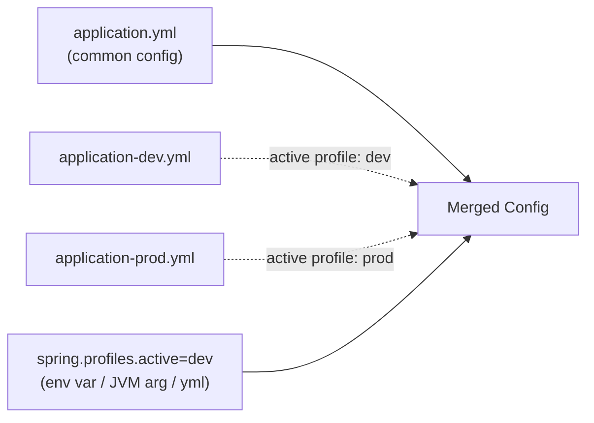

```java
@Service
@Profile("dev")
public class MockPaymentService implements PaymentService { }

@Service
@Profile("prod")
public class RealPaymentService implements PaymentService { }
```
```bash
java -jar app.jar --spring.profiles.active=prod
```

**Why interviewers ask:** Real deployments always need dev/staging/prod separation (different DB URLs, different Kafka clusters) -- this tests operational maturity, not just coding.

**Q&A:**
- **Q: How do you activate multiple profiles at once?**
  A: spring.profiles.active=dev,debug -- comma-separated, later ones can override earlier ones' properties.
- **Q: Can you conditionally load an entire @Configuration class based on profile?**
  A: Yes, @Profile("prod") on the class itself -- the whole config class (and its beans) is skipped unless that profile is active.
- **Q: How would you avoid checking in secrets (DB passwords) into application-prod.yml?**
  A: Use placeholders resolved from environment variables (password: ${DB_PASSWORD}) or a secrets manager (Vault, GCP Secret Manager), injected at deploy time rather than committed to source control.

---

# SECTION 5: KAFKA & REDIS (Nexus-relevant)

## 14. Kafka Integration

**What it is:**
- Kafka decouples producers and consumers via topics (partitioned, ordered logs). In Spring Boot: spring-kafka gives you KafkaTemplate (producer) and @KafkaListener (consumer).

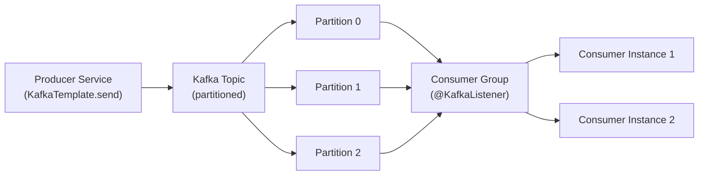

```java
@Service
public class RideEventProducer {
    private final KafkaTemplate<String, RideEvent> kafkaTemplate;

    public void publish(RideEvent event) {
        kafkaTemplate.send("ride-events", event.getRiderId(), event); // key = riderId for ordering
    }
}

@Component
public class RideEventConsumer {
    @KafkaListener(topics = "ride-events", groupId = "matching-service")
    public void consume(RideEvent event) {
        // process
    }
}
```

**Key concepts to know:** partitions (parallelism unit), consumer groups (each partition consumed by exactly one consumer in a group), offset (position tracked per partition), keys (determine which partition a message lands in -- same key = same partition = ordering guarantee).

**Why interviewers ask:** Since you'll talk about Nexus's Kafka usage, expect deep-dive questions on why Kafka over a direct call, partition strategy, and delivery guarantees -- not just "how do you produce a message."

**Q&A:**
- **Q: Why use Kafka instead of a direct REST call between services?**
  A: Decoupling (producer doesn't need consumer to be up), buffering against traffic spikes, replayability (consumers can reprocess from an offset), and enabling multiple independent consumers off the same event stream without the producer knowing about them.
- **Q: How does Kafka guarantee ordering, and what's the catch?**
  A: Ordering is only guaranteed within a partition. Messages with the same key always land on the same partition, so you get per-key ordering -- but no global ordering across the whole topic.
- **Q: At-least-once vs exactly-once delivery -- what does Spring Kafka give you by default?**
  A: Default is at-least-once (consumer may reprocess a message after a failure/rebalance before committing offset) -- your consumer logic should be idempotent. Exactly-once requires transactional producers/consumers explicitly configured.

---

## 15. Redis Integration

**What it is:**
- Redis is an in-memory key-value store used for caching, distributed locking, session storage, and fast lookups (like your H3 geospatial rider-matching use case).

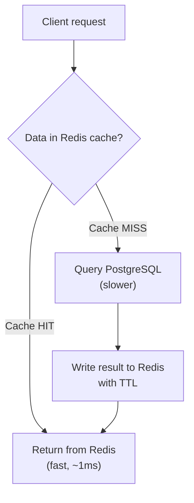

```java
@Service
public class UserService {
    @Cacheable(value = "users", key = "#id")
    public UserDto findById(Long id) {
        return userRepository.findById(id).map(this::toDto).orElseThrow();
    }

    @CacheEvict(value = "users", key = "#id")
    public void update(Long id, UserDto dto) { }
}
```

```java
// Atomic operation example (relevant to your SET NX rider-assignment pattern)
Boolean acquired = redisTemplate.opsForValue()
        .setIfAbsent("lock:ride:" + rideId, riderId, Duration.ofSeconds(30));
```

**Why interviewers ask:** Tests whether you understand caching strategy (invalidation, TTL, cache-aside pattern) rather than just annotation syntax -- and given Nexus, expect a question specifically about atomic operations for distributed coordination.

**Q&A:**
- **Q: What is the cache-aside pattern, and how does @Cacheable implement it?**
  A: App checks cache first; on a miss it loads from the DB and populates the cache for next time. @Cacheable wraps this: on the first call it executes the method and caches the result keyed by the given key; subsequent calls with the same key skip the method and return the cached value.
- **Q: Why is SET NX (setIfAbsent) atomic, and why does that matter for distributed locking?**
  A: SET NX is a single atomic Redis command -- check-and-set happens in one operation, so two concurrent processes can't both "win" the check. Without atomicity (e.g., separate GET then SET), a race condition could let two processes both believe they acquired the lock.
- **Q: What's a cache stampede, and how do you prevent it?**
  A: When a popular cache key expires and many concurrent requests all miss simultaneously, hammering the DB at once. Mitigations: locking around cache population (only one request repopulates, others wait), staggered/jittered TTLs, or probabilistic early refresh.

---

# SECTION 6: SECURITY

## 16. Spring Security Basics

**What it is:**
- A filter-chain-based framework that intercepts every request before it reaches your controller, handling authentication (who are you) and authorization (what can you do).

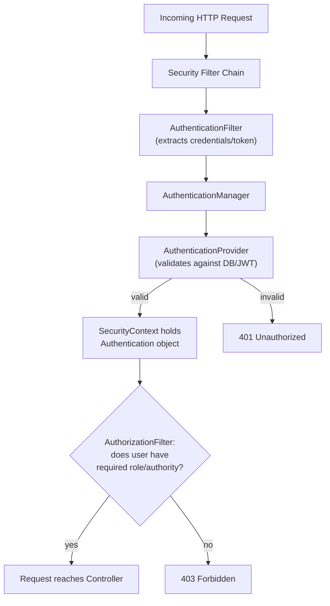

```java
@Configuration
@EnableWebSecurity
public class SecurityConfig {
    @Bean
    public SecurityFilterChain filterChain(HttpSecurity http) throws Exception {
        http
            .csrf(csrf -> csrf.disable())
            .authorizeHttpRequests(auth -> auth
                .requestMatchers("/api/auth/**").permitAll()
                .requestMatchers("/api/admin/**").hasRole("ADMIN")
                .anyRequest().authenticated())
            .sessionManagement(sm -> sm.sessionCreationPolicy(SessionCreationPolicy.STATELESS));
        return http.build();
    }

    @Bean
    public PasswordEncoder passwordEncoder() { return new BCryptPasswordEncoder(); }
}
```

**Why interviewers ask:** Security is a common gap area for junior devs -- this checks if you understand the filter chain model, not just "I added Spring Security dependency."

**Q&A:**
- **Q: Authentication vs Authorization -- what's the difference?**
  A: Authentication verifies who you are (login/credentials check). Authorization determines what you're allowed to do (roles/permissions), and happens after authentication succeeds.
- **Q: Why disable CSRF for a stateless REST API using JWT?**
  A: CSRF protection defends against browser-based attacks exploiting cookie-based sessions. A stateless JWT-in-header API doesn't rely on cookies for auth, so the CSRF attack vector doesn't apply the same way -- session-based apps still need it.
- **Q: Why use BCryptPasswordEncoder instead of storing/comparing plain text or MD5/SHA1 hashes?**
  A: BCrypt is a slow, salted, adaptive hashing algorithm specifically designed to resist brute-force and rainbow-table attacks -- MD5/SHA1 are fast general-purpose hashes, which makes them practical to brute-force at scale for password cracking.

---

## 17. JWT Implementation

**What it is:**
- JSON Web Token: a self-contained, signed token carrying claims (user id, roles, expiry). Stateless -- server doesn't need to store session data, just verifies the signature.

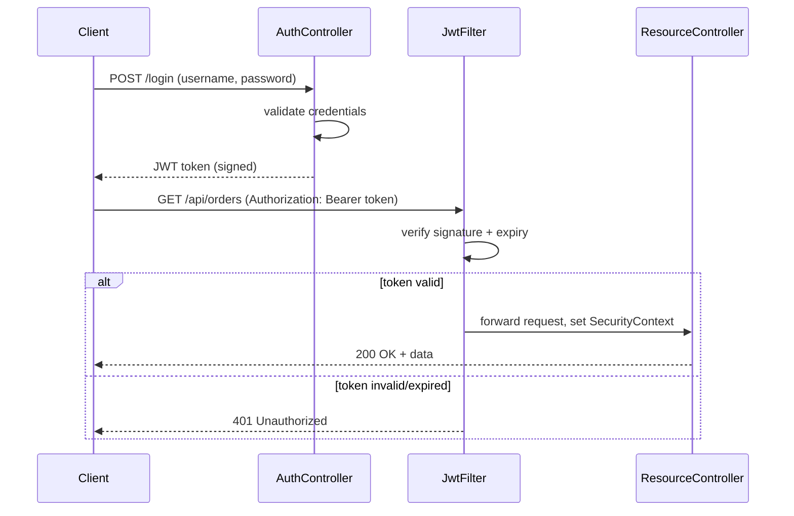

**JWT structure:** header.payload.signature
- **Header:** algorithm (e.g., HS256)
- **Payload:** claims (sub, roles, exp, iat) -- Base64 encoded, not encrypted, anyone can decode and read it
- **Signature:** HMACSHA256(base64(header) + "." + base64(payload), secret) -- proves it wasn't tampered with

```java
public class JwtAuthFilter extends OncePerRequestFilter {
    protected void doFilterInternal(HttpServletRequest req, HttpServletResponse res, FilterChain chain) {
        String token = extractToken(req);
        if (token != null && jwtUtil.isValid(token)) {
            Authentication auth = jwtUtil.getAuthentication(token);
            SecurityContextHolder.getContext().setAuthentication(auth);
        }
        chain.doFilter(req, res);
    }
}
```

**Why interviewers ask:** JWT is the standard for stateless API auth -- expect questions on the security gotchas (storage, revocation) that show whether you've actually thought about attack surfaces, not just wired up a library.

**Q&A:**
- **Q: Since JWT payload isn't encrypted, what should you never put in it?**
  A: Sensitive data (passwords, secrets, PII you wouldn't want exposed) -- anyone with the token can Base64-decode and read the payload. Only put claims safe to expose (user id, roles, expiry).
- **Q: How do you handle JWT revocation (e.g., logout, compromised token) given it's stateless?**
  A: Pure JWT has no built-in revocation -- options: short expiry + refresh tokens, maintain a server-side blocklist (often in Redis, keyed by token/jti with TTL = remaining token life), or a version/timestamp check against the user's "last invalidated" time in DB.
- **Q: Access token vs refresh token -- why have both?**
  A: Access token is short-lived (minutes) and used for API calls -- limits exposure window if leaked. Refresh token is long-lived and stored more securely, used only to get a new access token -- reduces how often you send the long-lived credential over the wire.

---

# SECTION 7: ADVANCED

## 18. Spring Boot Actuator

**What it is:**
- Production-ready monitoring endpoints (health, metrics, env, beans) exposed out of the box for observability -- no custom code needed.

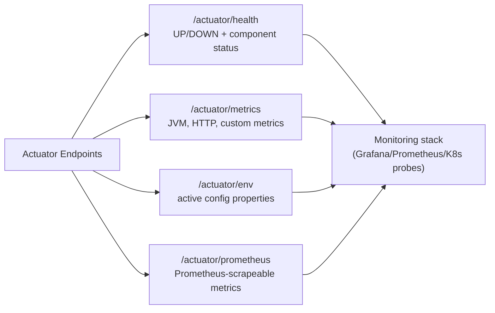

```yaml
management:
  endpoints:
    web:
      exposure:
        include: health, metrics, prometheus
  endpoint:
    health:
      show-details: always
```

```java
@Component
public class KafkaHealthIndicator implements HealthIndicator {
    public Health health() {
        return isKafkaReachable() ? Health.up().build()
                                   : Health.down().withDetail("reason", "broker unreachable").build();
    }
}
```

**Why interviewers ask:** Given your K8s work, this connects directly -- Actuator's /health is typically wired as K8s liveness/readiness probes, so this is a natural cross-domain question for you.

**Q&A:**
- **Q: How does /actuator/health relate to Kubernetes liveness/readiness probes?**
  A: K8s hits /actuator/health/liveness and /actuator/health/readiness (with Boot's health groups) -- liveness tells K8s "restart me if this fails," readiness tells it "don't route traffic to me yet." Actuator gives you this contract without hand-writing it.
- **Q: Why should Actuator endpoints not be publicly exposed without protection in production?**
  A: They can leak sensitive info (/env, /beans, /configprops can expose config/secrets, internal structure). Best practice: expose only necessary endpoints, put them behind auth, and often run them on a separate management port.
- **Q: How do you add a custom application metric (e.g., "rides matched count")?**
  A: Inject MeterRegistry and use Counter/Gauge/Timer (Micrometer) -- e.g., meterRegistry.counter("rides.matched").increment() -- auto-exposed via /actuator/metrics and scrapeable by Prometheus.

---

## 19. Testing

**What it is:**
- Layered testing strategy: unit tests (isolated, mocked deps) -> slice tests (one layer, real Spring context for that layer) -> integration tests (full context, real-ish infra).

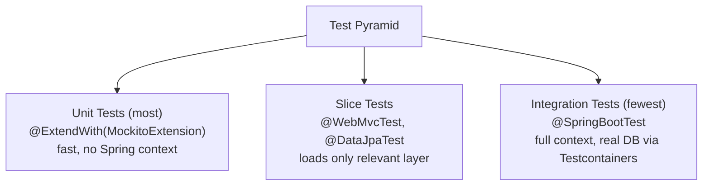

```java
// Unit test -- no Spring context, pure Mockito
@ExtendWith(MockitoExtension.class)
class OrderServiceTest {
    @Mock private OrderRepository orderRepository;
    @InjectMocks private OrderService orderService;

    @Test
    void shouldThrowWhenOrderNotFound() {
        when(orderRepository.findById(1L)).thenReturn(Optional.empty());
        assertThrows(OrderNotFoundException.class, () -> orderService.getOrder(1L));
    }
}

// Web layer slice test -- only loads MVC infra, mocks the service
@WebMvcTest(OrderController.class)
class OrderControllerTest {
    @Autowired private MockMvc mockMvc;
    @MockBean private OrderService orderService;

    @Test
    void shouldReturn200() throws Exception {
        mockMvc.perform(get("/api/orders/1")).andExpect(status().isOk());
    }
}

// Full integration test with real Postgres via Testcontainers
@SpringBootTest
@Testcontainers
class OrderIntegrationTest {
    @Container
    static PostgreSQLContainer<?> postgres = new PostgreSQLContainer<>("postgres:15");
}
```

**Why interviewers ask:** Testing maturity is a strong signal of production experience -- expect questions distinguishing @Mock/@MockBean/@Spy, and why you wouldn't @SpringBootTest everything.

**Q&A:**
- **Q: Why not just use @SpringBootTest for every test?**
  A: It boots the full application context -- slow (seconds per test class) and tests more surface area than needed, making failures harder to localize. Slice tests (@WebMvcTest, @DataJpaTest) load only what's needed, run fast, and isolate the layer under test.
- **Q: @Mock vs @MockBean -- what's the difference?**
  A: @Mock (pure Mockito) creates a mock with no Spring context involvement -- used in plain unit tests. @MockBean replaces a real bean in the Spring ApplicationContext with a mock -- used in slice/integration tests where the context is loaded.
- **Q: Why use Testcontainers instead of an in-memory DB like H2 for integration tests?**
  A: H2 behaves differently from real Postgres/MySQL (different SQL dialect, different constraint behavior) -- tests can pass against H2 and fail in production. Testcontainers spins up the real DB in Docker, giving high-fidelity test results.

---

## 20. Logging

**What it is:**
- Spring Boot uses SLF4J as the logging facade (with Logback as default implementation) -- you code against SLF4J's API regardless of the underlying implementation.

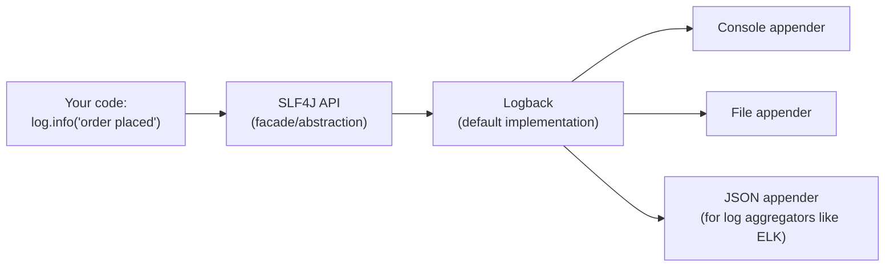

```java
@Slf4j
@Service
public class OrderService {
    public void placeOrder(Order order) {
        log.info("Placing order for user={}, orderId={}", order.getUserId(), order.getId());
        try {
        } catch (Exception e) {
            log.error("Failed to place order for orderId={}", order.getId(), e);
        }
    }
}
```

```yaml
logging:
  level:
    root: INFO
    com.yourapp: DEBUG
  pattern:
    console: "%d{yyyy-MM-dd HH:mm:ss} [%thread] %-5level %logger{36} - %msg%n"
```

**Why interviewers ask:** Distinguishes people who know log levels are a tool (for filtering noise in production) from people who just print everything at INFO.

**Q&A:**
- **Q: Why use log.info("id={}", id) (parameterized) instead of string concatenation log.info("id=" + id)?**
  A: String concatenation always builds the string even if the log level is disabled (wasted work). Parameterized logging only formats the string if the log level is actually enabled -- cheaper at scale, especially for DEBUG logs left in hot paths.
- **Q: What's the danger of logging at DEBUG/TRACE level in production without control?**
  A: Log volume explosion -- costs (storage/ingestion in ELK/Splunk), noise that buries important logs, and potential performance impact from I/O. Keep production default at INFO/WARN, enable DEBUG selectively per-package when actively debugging.
- **Q: How would you trace a single request across multiple log lines/services?**
  A: A correlation/trace ID (e.g., via MDC -- Mapped Diagnostic Context) generated at request entry and included in every log line for that request, propagated across service calls (often via a header) so logs from different services can be joined by that ID.

---

## 21. All Important Properties (Quick Reference)

```yaml
# Server
server.port: 8080
server.servlet.context-path: /api

# Datasource
spring.datasource.url: jdbc:postgresql://localhost:5432/mydb
spring.datasource.username: user
spring.datasource.password: pass
spring.datasource.hikari.maximum-pool-size: 10

# JPA / Hibernate
spring.jpa.hibernate.ddl-auto: validate   # never update/create in prod!
spring.jpa.show-sql: true
spring.jpa.properties.hibernate.default_batch_fetch_size: 50

# Profiles
spring.profiles.active: dev

# Kafka
spring.kafka.bootstrap-servers: localhost:9092
spring.kafka.consumer.group-id: my-group
spring.kafka.consumer.auto-offset-reset: earliest

# Redis
spring.data.redis.host: localhost
spring.data.redis.port: 6379

# Actuator
management.endpoints.web.exposure.include: health,metrics,prometheus

# Logging
logging.level.root: INFO

# Jackson
spring.jackson.default-property-inclusion: non_null
```

**Interview-relevant note:** ddl-auto: update/create in production is a classic red flag question -- always know to say validate or none (with Flyway/Liquibase managing schema) in production.

---

## 22. All Annotations Quick Reference

| Category | Annotation | Purpose |
|---|---|---|
| Bootstrapping | @SpringBootApplication | Entry point; combines 3 annotations below |
| | @Configuration | Marks a class as a source of bean definitions |
| | @EnableAutoConfiguration | Triggers auto-config based on classpath |
| | @ComponentScan | Scans package for @Component classes |
| Stereotypes | @Component | Generic Spring-managed bean |
| | @Service | Business logic layer (semantic marker) |
| | @Repository | Data access layer; also translates DB exceptions |
| | @Controller / @RestController | Web layer; latter = @Controller + @ResponseBody |
| DI | @Autowired | Injects a dependency |
| | @Qualifier | Disambiguates when multiple beans of same type exist |
| | @Primary | Marks default bean when multiple candidates exist |
| Bean lifecycle | @Bean | Declares a bean inside a @Configuration class |
| | @PostConstruct / @PreDestroy | Init/cleanup hooks |
| | @Scope | Sets bean scope (singleton/prototype/etc.) |
| Web | @RequestMapping / @GetMapping etc. | Maps HTTP requests to methods |
| | @PathVariable | Binds URI path segment |
| | @RequestParam | Binds query parameter |
| | @RequestBody | Binds JSON request body to object |
| | @ResponseStatus | Sets HTTP status for a response/exception |
| Validation | @Valid | Triggers bean validation |
| | @NotNull @NotBlank @Size etc. | Field-level constraints |
| Exception handling | @ExceptionHandler | Handles specific exception type |
| | @RestControllerAdvice | Global exception handler + @ResponseBody |
| JPA | @Entity @Table @Id @GeneratedValue | ORM mapping basics |
| | @OneToMany @ManyToOne @ManyToMany @OneToOne | Relationship mapping |
| | @JoinColumn @JoinTable | FK/join table config |
| Transactions | @Transactional | Wraps method in DB transaction |
| Configuration | @Value | Injects a single property value |
| | @ConfigurationProperties | Type-safe grouped property binding |
| | @Profile | Conditionally activates bean/config per profile |
| | @Conditional* family | Auto-config conditions (@ConditionalOnClass etc.) |
| Caching | @Cacheable @CacheEvict @CachePut | Cache-aside pattern annotations |
| | @EnableCaching | Enables caching support |
| Kafka | @KafkaListener | Marks a method as a Kafka consumer |
| | @EnableKafka | Enables Kafka listener annotation processing |
| Security | @EnableWebSecurity | Enables Spring Security web config |
| | @PreAuthorize @PostAuthorize | Method-level authorization (SpEL expressions) |
| Testing | @SpringBootTest | Loads full application context |
| | @WebMvcTest @DataJpaTest | Slice tests (partial context) |
| | @MockBean | Replaces a bean in context with a mock |
| | @ExtendWith(MockitoExtension.class) | Enables Mockito in JUnit5, no Spring context |
